# Attn_habituation_glm
May Dixon  
September 21, 2016  

## Three main sections
*initial preference*
*rates of habituation*
*discrimination*


# Initial interest
In this section we are assessing which treatments had the highest initial responses (the most twitches in the first "set" of calls for each treatment per bat)
\


## Initial interest  with generalized linear mixed model (log-linked)
load these libraries: 


```r
library(lme4)
```

```
## Loading required package: Matrix
```

```r
library(ggplot2)
```

```r
 attn_int_2 <- read.table("/Users/maydixon/Dropbox/Attention Project/R/attn_for_initial_interest.txt", header=TRUE) #local
# OR
 # attn_int_2<- read.table("https://raw.githubusercontent.com/maydixon/Attn_Project/master/attn_for_initial_interest_2.7.17.txt", sep="\t", header=TRUE) #on github
        head(attn_int_2)
```

```
##   Bat_ID      bat_name video_ID trial_name trial_name_2 primary_stim
## 1   Bat1  Wramplemeier M2U02127    de_t_de      de_t_de           De
## 2  Bat10         Insor M2U02313    de_t_de      de_t_de           De
## 3  Bat11         Linus M2U02325    de_t_de      de_t_de           De
## 4  Bat12          Vila M2U02346    de_t_de      de_t_de           De
## 5  Bat13         Paris M2U02353    de_t_de      de_t_de           De
## 6  Bat14 Captain_Isaac M2U02370    de_t_de      de_t_de           De
##   first_stim trial_number sm_tw_trial md_tw_trial lg_tw_trial all_tw_trial
## 1         De            2           9           0          14           23
## 2         De            6           3           1           0            4
## 3         De            8           7           2          43           52
## 4         De            8          11           9          16           36
## 5         De            4          14           0          49           63
## 6         De           10           7           0          42           49
##   total_tw Orienting_trial Flying_trial Approach_trial Grooming_trial
## 1       87               0            3              0              1
## 2       94               0            0              0              0
## 3      332               6            3              1              2
## 4      235               1            1              1              5
## 5      235               3            0              0              0
## 6      363               3            3              1              0
##   Landing_trial Yawning_trial set_num sm_tw_set md_tw_set lg_tw_set
## 1             1             0       1         0         0        10
## 2             0             0       1         1         0         0
## 3             0             1       1         2         2         6
## 4             0             0       1         0         0         0
## 5             0             0       1         0         0         6
## 6             0             5       1         2         0         8
##   all_tw_set Orienting_set
## 1         10             0
## 2          1             0
## 3         10             1
## 4          0             0
## 5          6             1
## 6         10             0
```

## Model Selection

```r
        # model: the number of initial twitches is explained by the playback type, with bat id and/ or trial # as a random effect:
        
        initial_int_1 <- glmer(all_tw_set ~ first_stim + (trial_number|Bat_ID), family= "poisson", data = attn_int_2) #model with nested interaction effect/ full model
      
       initial_int_2 <- glmer(all_tw_set ~ first_stim + (1|Bat_ID), family= "poisson", data = attn_int_2) #model with nested interaction effect #
        s_ii1 <- summary(initial_int_1)
        s_ii2 <- summary(initial_int_2)
        s_ii1
```

```
## Generalized linear mixed model fit by maximum likelihood (Laplace
##   Approximation) [glmerMod]
##  Family: poisson  ( log )
## Formula: all_tw_set ~ first_stim + (trial_number | Bat_ID)
##    Data: attn_int_2
## 
##      AIC      BIC   logLik deviance df.resid 
##    688.8    716.2   -334.4    668.8      105 
## 
## Scaled residuals: 
##     Min      1Q  Median      3Q     Max 
## -2.5292 -1.1101 -0.2473  0.9989  5.0987 
## 
## Random effects:
##  Groups Name         Variance Std.Dev. Corr 
##  Bat_ID (Intercept)  0.25269  0.5027        
##         trial_number 0.02047  0.1431   -0.04
## Number of obs: 115, groups:  Bat_ID, 13
## 
## Fixed effects:
##               Estimate Std. Error z value Pr(>|z|)    
## (Intercept)    1.67581    0.30194   5.550 2.85e-08 ***
## first_stimRa   0.28236    0.17411   1.622  0.10486    
## first_stimRra  0.93466    0.17586   5.315 1.07e-07 ***
## first_stimRt   0.15438    0.19447   0.794  0.42728    
## first_stimT1c  0.14232    0.17608   0.808  0.41895    
## first_stimT2c  0.57801    0.19005   3.041  0.00236 ** 
## first_stimTs   0.05126    0.15816   0.324  0.74588    
## ---
## Signif. codes:  0 '***' 0.001 '**' 0.01 '*' 0.05 '.' 0.1 ' ' 1
## 
## Correlation of Fixed Effects:
##             (Intr) first_stmR frst_stmRr frst_stmRt frs_T1 frs_T2
## first_stimR -0.250                                               
## first_stmRr -0.534  0.486                                        
## first_stmRt -0.442  0.455      0.630                             
## frst_stmT1c -0.482  0.500      0.680      0.560                  
## frst_stmT2c -0.491  0.447      0.668      0.550      0.682       
## first_stmTs -0.415  0.598      0.649      0.581      0.646  0.611
```

```r
        s_ii2
```

```
## Generalized linear mixed model fit by maximum likelihood (Laplace
##   Approximation) [glmerMod]
##  Family: poisson  ( log )
## Formula: all_tw_set ~ first_stim + (1 | Bat_ID)
##    Data: attn_int_2
## 
##      AIC      BIC   logLik deviance df.resid 
##    716.6    738.5   -350.3    700.6      107 
## 
## Scaled residuals: 
##    Min     1Q Median     3Q    Max 
## -3.000 -1.092 -0.273  1.015  5.984 
## 
## Random effects:
##  Groups Name        Variance Std.Dev.
##  Bat_ID (Intercept) 0.5174   0.7193  
## Number of obs: 115, groups:  Bat_ID, 13
## 
## Fixed effects:
##               Estimate Std. Error z value Pr(>|z|)    
## (Intercept)    1.35945    0.23983   5.668 1.44e-08 ***
## first_stimRa   0.38335    0.17020   2.252   0.0243 *  
## first_stimRra  0.79292    0.15765   5.029 4.92e-07 ***
## first_stimRt   0.11601    0.18088   0.641   0.5213    
## first_stimT1c -0.06011    0.15901  -0.378   0.7054    
## first_stimT2c  0.32448    0.16869   1.924   0.0544 .  
## first_stimTs   0.06039    0.15576   0.388   0.6982    
## ---
## Signif. codes:  0 '***' 0.001 '**' 0.01 '*' 0.05 '.' 0.1 ' ' 1
## 
## Correlation of Fixed Effects:
##             (Intr) first_stmR frst_stmRr frst_stmRt frs_T1 frs_T2
## first_stimR -0.405                                               
## first_stmRr -0.437  0.623                                        
## first_stmRt -0.381  0.543      0.587                             
## frst_stmT1c -0.433  0.610      0.659      0.574                  
## frst_stmT2c -0.408  0.575      0.621      0.541      0.616       
## first_stmTs -0.444  0.623      0.673      0.586      0.667  0.629
```

```r
        # So, using AIC, using trial number as a nested random effect with batID is a slightly better model than Bat_ID alone
        #I'll use just the first model initial_int_1 from here on out. 
```
So this model is best:  initial_int_1 <- glmer(all_tw_set ~ trial_name_2 + (trial_number|Bat_ID), family= "poisson", data = attn_int_2) 
   
## Initial interest results

```r
#continuing to run initial interest with glmer 
        levels(attn_int_2$trial_name_2)
```

```
## [1] "de_t_de"     "ra_t_ra"     "rra_rt_rra"  "rt_rra_rt"   "t_de_t"     
## [6] "t_ra_t"      "tc_ts_tc"    "tia_tib_tia" "ts_tc_ts"
```

```r
        initial_int_1 <- glmer(all_tw_set ~ first_stim + (trial_number|Bat_ID), family= "poisson", data = attn_int_2) #model with nested interaction effect
        
# running glmer 
# using relevel to find the true value (intercept) for each variable, and what is significantly different from each variable. 
        
        
        attn_int_2$first_stim <- relevel(attn_int_2$first_stim,"De") #MAKE DE REFERENCE
        nlme_int_de_ref<- glmer(all_tw_set ~ first_stim + (trial_number|Bat_ID), family= "poisson", data = attn_int_2)
        summary(nlme_int_de_ref)
```

```
## Generalized linear mixed model fit by maximum likelihood (Laplace
##   Approximation) [glmerMod]
##  Family: poisson  ( log )
## Formula: all_tw_set ~ first_stim + (trial_number | Bat_ID)
##    Data: attn_int_2
## 
##      AIC      BIC   logLik deviance df.resid 
##    688.8    716.2   -334.4    668.8      105 
## 
## Scaled residuals: 
##     Min      1Q  Median      3Q     Max 
## -2.5292 -1.1101 -0.2473  0.9989  5.0987 
## 
## Random effects:
##  Groups Name         Variance Std.Dev. Corr 
##  Bat_ID (Intercept)  0.25269  0.5027        
##         trial_number 0.02047  0.1431   -0.04
## Number of obs: 115, groups:  Bat_ID, 13
## 
## Fixed effects:
##               Estimate Std. Error z value Pr(>|z|)    
## (Intercept)    1.67581    0.30194   5.550 2.85e-08 ***
## first_stimRa   0.28236    0.17411   1.622  0.10486    
## first_stimRra  0.93466    0.17586   5.315 1.07e-07 ***
## first_stimRt   0.15438    0.19447   0.794  0.42728    
## first_stimT1c  0.14232    0.17608   0.808  0.41895    
## first_stimT2c  0.57801    0.19005   3.041  0.00236 ** 
## first_stimTs   0.05126    0.15816   0.324  0.74588    
## ---
## Signif. codes:  0 '***' 0.001 '**' 0.01 '*' 0.05 '.' 0.1 ' ' 1
## 
## Correlation of Fixed Effects:
##             (Intr) first_stmR frst_stmRr frst_stmRt frs_T1 frs_T2
## first_stimR -0.250                                               
## first_stmRr -0.534  0.486                                        
## first_stmRt -0.442  0.455      0.630                             
## frst_stmT1c -0.482  0.500      0.680      0.560                  
## frst_stmT2c -0.491  0.447      0.668      0.550      0.682       
## first_stmTs -0.415  0.598      0.649      0.581      0.646  0.611
```

```r
        #De is only significantly different than rra (lower)
        
        attn_int_2$first_stim <- relevel(attn_int_2$first_stim,"Ra") #MAKE RA REFERENCE
        nlme_int_ra_ref<- glmer(all_tw_set ~ first_stim + (trial_number|Bat_ID), family= "poisson", data = attn_int_2)
        summary(nlme_int_ra_ref)
```

```
## Generalized linear mixed model fit by maximum likelihood (Laplace
##   Approximation) [glmerMod]
##  Family: poisson  ( log )
## Formula: all_tw_set ~ first_stim + (trial_number | Bat_ID)
##    Data: attn_int_2
## 
##      AIC      BIC   logLik deviance df.resid 
##    688.8    716.2   -334.4    668.8      105 
## 
## Scaled residuals: 
##     Min      1Q  Median      3Q     Max 
## -2.5291 -1.1102 -0.2473  0.9989  5.0986 
## 
## Random effects:
##  Groups Name         Variance Std.Dev. Corr 
##  Bat_ID (Intercept)  0.25263  0.5026        
##         trial_number 0.02047  0.1431   -0.04
## Number of obs: 115, groups:  Bat_ID, 13
## 
## Fixed effects:
##               Estimate Std. Error z value Pr(>|z|)    
## (Intercept)     1.9583     0.3085   6.348 2.18e-10 ***
## first_stimDe   -0.2824     0.1741  -1.622 0.104859    
## first_stimRra   0.6523     0.1775   3.676 0.000237 ***
## first_stimRt   -0.1281     0.1932  -0.663 0.507343    
## first_stimT1c  -0.1401     0.1751  -0.800 0.423728    
## first_stimT2c   0.2956     0.1920   1.540 0.123618    
## first_stimTs   -0.2311     0.1496  -1.545 0.122419    
## ---
## Signif. codes:  0 '***' 0.001 '**' 0.01 '*' 0.05 '.' 0.1 ' ' 1
## 
## Correlation of Fixed Effects:
##             (Intr) frst_D frst_stmRr frst_stmRt frs_T1 frs_T2
## first_stimD -0.320                                           
## first_stmRr -0.560  0.500                                    
## first_stmRt -0.465  0.443  0.629                             
## frst_stmT1c -0.508  0.491  0.681      0.554                  
## frst_stmT2c -0.516  0.465  0.674      0.552      0.684       
## first_stmTs -0.444  0.531  0.641      0.565      0.629  0.606
```

```r
        attn_int_2$first_stim <- relevel(attn_int_2$first_stim,"Rra") #MAKE RRA REFERENCE
        nlme_int_rra_ref<- glmer(all_tw_set ~ first_stim + (trial_number|Bat_ID), family= "poisson", data = attn_int_2)
        summary(nlme_int_rra_ref)
```

```
## Generalized linear mixed model fit by maximum likelihood (Laplace
##   Approximation) [glmerMod]
##  Family: poisson  ( log )
## Formula: all_tw_set ~ first_stim + (trial_number | Bat_ID)
##    Data: attn_int_2
## 
##      AIC      BIC   logLik deviance df.resid 
##    688.8    716.2   -334.4    668.8      105 
## 
## Scaled residuals: 
##     Min      1Q  Median      3Q     Max 
## -2.5292 -1.1102 -0.2473  0.9989  5.0986 
## 
## Random effects:
##  Groups Name         Variance Std.Dev. Corr 
##  Bat_ID (Intercept)  0.25266  0.5027        
##         trial_number 0.02047  0.1431   -0.04
## Number of obs: 115, groups:  Bat_ID, 13
## 
## Fixed effects:
##               Estimate Std. Error z value Pr(>|z|)    
## (Intercept)     2.6105     0.2557  10.207  < 2e-16 ***
## first_stimRa   -0.6523     0.1775  -3.676 0.000237 ***
## first_stimDe   -0.9347     0.1759  -5.315 1.07e-07 ***
## first_stimRt   -0.7803     0.1602  -4.871 1.11e-06 ***
## first_stimT1c  -0.7923     0.1408  -5.627 1.84e-08 ***
## first_stimT2c  -0.3567     0.1497  -2.382 0.017197 *  
## first_stimTs   -0.8834     0.1408  -6.274 3.52e-10 ***
## ---
## Signif. codes:  0 '***' 0.001 '**' 0.01 '*' 0.05 '.' 0.1 ' ' 1
## 
## Correlation of Fixed Effects:
##             (Intr) first_stmR frst_D frst_stmRt frs_T1 frs_T2
## first_stimR -0.019                                           
## first_stimD -0.058  0.514                                    
## first_stmRt -0.170  0.349      0.333                         
## frst_stmT1c -0.198  0.414      0.399  0.332                  
## frst_stmT2c -0.220  0.321      0.327  0.309      0.492       
## first_stmTs -0.121  0.579      0.520  0.408      0.494  0.422
```

```r
        attn_int_2$first_stim <- relevel(attn_int_2$first_stim,"Rt") #MAKE RT REFERENCE
        nlme_int_rt_ref<- glmer(all_tw_set ~ first_stim + (trial_number|Bat_ID), family= "poisson", data = attn_int_2)
        summary(nlme_int_rt_ref)
```

```
## Generalized linear mixed model fit by maximum likelihood (Laplace
##   Approximation) [glmerMod]
##  Family: poisson  ( log )
## Formula: all_tw_set ~ first_stim + (trial_number | Bat_ID)
##    Data: attn_int_2
## 
##      AIC      BIC   logLik deviance df.resid 
##    688.8    716.2   -334.4    668.8      105 
## 
## Scaled residuals: 
##     Min      1Q  Median      3Q     Max 
## -2.5292 -1.1102 -0.2472  0.9989  5.0987 
## 
## Random effects:
##  Groups Name         Variance Std.Dev. Corr 
##  Bat_ID (Intercept)  0.25267  0.5027        
##         trial_number 0.02047  0.1431   -0.04
## Number of obs: 115, groups:  Bat_ID, 13
## 
## Fixed effects:
##               Estimate Std. Error z value Pr(>|z|)    
## (Intercept)    1.83023    0.27770   6.591 4.38e-11 ***
## first_stimRra  0.78027    0.16019   4.871 1.11e-06 ***
## first_stimRa   0.12798    0.19322   0.662   0.5077    
## first_stimDe  -0.15440    0.19447  -0.794   0.4272    
## first_stimT1c -0.01207    0.17463  -0.069   0.9449    
## first_stimT2c  0.42360    0.18237   2.323   0.0202 *  
## first_stimTs  -0.10315    0.16451  -0.627   0.5307    
## ---
## Signif. codes:  0 '***' 0.001 '**' 0.01 '*' 0.05 '.' 0.1 ' ' 1
## 
## Correlation of Fixed Effects:
##             (Intr) frst_stmRr first_stmR frst_D frs_T1 frs_T2
## first_stmRr -0.420                                           
## first_stimR -0.179  0.509                                    
## first_stimD -0.220  0.522      0.597                         
## frst_stmT1c -0.378  0.649      0.551      0.549              
## frst_stmT2c -0.389  0.625      0.479      0.493  0.663       
## first_stmTs -0.302  0.624      0.661      0.623  0.653  0.598
```

```r
        attn_int_2$first_stim <- relevel(attn_int_2$first_stim,"Ts") #MAKE Ts REFERENCE
        nlme_int_ts_ref<- glmer(all_tw_set ~ first_stim + (trial_number|Bat_ID), family= "poisson", data = attn_int_2)
        summary(nlme_int_ts_ref)
```

```
## Generalized linear mixed model fit by maximum likelihood (Laplace
##   Approximation) [glmerMod]
##  Family: poisson  ( log )
## Formula: all_tw_set ~ first_stim + (trial_number | Bat_ID)
##    Data: attn_int_2
## 
##      AIC      BIC   logLik deviance df.resid 
##    688.8    716.2   -334.4    668.8      105 
## 
## Scaled residuals: 
##     Min      1Q  Median      3Q     Max 
## -2.5292 -1.1102 -0.2473  0.9989  5.0986 
## 
## Random effects:
##  Groups Name         Variance Std.Dev. Corr 
##  Bat_ID (Intercept)  0.25265  0.5026        
##         trial_number 0.02047  0.1431   -0.04
## Number of obs: 115, groups:  Bat_ID, 13
## 
## Fixed effects:
##               Estimate Std. Error z value Pr(>|z|)    
## (Intercept)    1.72711    0.27664   6.243 4.29e-10 ***
## first_stimRt   0.10312    0.16451   0.627 0.530763    
## first_stimRra  0.88341    0.14080   6.274 3.52e-10 ***
## first_stimRa   0.23113    0.14963   1.545 0.122417    
## first_stimDe  -0.05124    0.15816  -0.324 0.745954    
## first_stimT1c  0.09106    0.14164   0.643 0.520304    
## first_stimT2c  0.52674    0.15629   3.370 0.000751 ***
## ---
## Signif. codes:  0 '***' 0.001 '**' 0.01 '*' 0.05 '.' 0.1 ' ' 1
## 
## Correlation of Fixed Effects:
##             (Intr) frst_stmRt frst_stmRr first_stmR frst_D frs_T1
## first_stmRt -0.291                                               
## first_stmRr -0.397  0.458                                        
## first_stimR -0.045  0.246      0.255                             
## first_stimD -0.119  0.274      0.312      0.361                  
## frst_stmT1c -0.327  0.357      0.503      0.278      0.314       
## frst_stmT2c -0.347  0.355      0.496      0.213      0.269  0.519
```

```r
        attn_int_2$first_stim <- relevel(attn_int_2$first_stim,"T1c") #MAKE T1c REFERENCE
        nlme_int_t1c_ref<- glmer(all_tw_set ~ first_stim + (trial_number|Bat_ID), family= "poisson", data = attn_int_2)
        summary(nlme_int_t1c_ref)
```

```
## Generalized linear mixed model fit by maximum likelihood (Laplace
##   Approximation) [glmerMod]
##  Family: poisson  ( log )
## Formula: all_tw_set ~ first_stim + (trial_number | Bat_ID)
##    Data: attn_int_2
## 
##      AIC      BIC   logLik deviance df.resid 
##    688.8    716.2   -334.4    668.8      105 
## 
## Scaled residuals: 
##     Min      1Q  Median      3Q     Max 
## -2.5292 -1.1102 -0.2472  0.9989  5.0986 
## 
## Random effects:
##  Groups Name         Variance Std.Dev. Corr 
##  Bat_ID (Intercept)  0.25268  0.5027        
##         trial_number 0.02047  0.1431   -0.04
## Number of obs: 115, groups:  Bat_ID, 13
## 
## Fixed effects:
##               Estimate Std. Error z value Pr(>|z|)    
## (Intercept)    1.81821    0.26638   6.826 8.75e-12 ***
## first_stimTs  -0.09108    0.14164  -0.643  0.52022    
## first_stimRt   0.01204    0.17463   0.069  0.94504    
## first_stimRra  0.79234    0.14081   5.627 1.84e-08 ***
## first_stimRa   0.14007    0.17508   0.800  0.42369    
## first_stimDe  -0.14233    0.17609  -0.808  0.41893    
## first_stimT2c  0.43565    0.14664   2.971  0.00297 ** 
## ---
## Signif. codes:  0 '***' 0.001 '**' 0.01 '*' 0.05 '.' 0.1 ' ' 1
## 
## Correlation of Fixed Effects:
##             (Intr) frst_T frst_stmRt frst_stmRr first_stmR frst_D
## first_stmTs -0.192                                               
## first_stmRt -0.262  0.475                                        
## first_stmRr -0.338  0.503  0.501                                 
## first_stimR -0.069  0.571  0.389      0.385                      
## first_stimD -0.115  0.522  0.385      0.401      0.508           
## frst_stmT2c -0.275  0.413  0.366      0.458      0.298      0.317
```

```r
        attn_int_2$first_stim <- relevel(attn_int_2$first_stim,"T2c") #MAKE T2c REFERENCE
        nlme_int_t2c_ref<- glmer(all_tw_set ~ first_stim + (trial_number|Bat_ID), family= "poisson", data = attn_int_2)
        summary(nlme_int_t2c_ref)
```

```
## Generalized linear mixed model fit by maximum likelihood (Laplace
##   Approximation) [glmerMod]
##  Family: poisson  ( log )
## Formula: all_tw_set ~ first_stim + (trial_number | Bat_ID)
##    Data: attn_int_2
## 
##      AIC      BIC   logLik deviance df.resid 
##    688.8    716.2   -334.4    668.8      105 
## 
## Scaled residuals: 
##     Min      1Q  Median      3Q     Max 
## -2.5292 -1.1102 -0.2472  0.9988  5.0987 
## 
## Random effects:
##  Groups Name         Variance Std.Dev. Corr 
##  Bat_ID (Intercept)  0.25266  0.5027        
##         trial_number 0.02047  0.1431   -0.04
## Number of obs: 115, groups:  Bat_ID, 13
## 
## Fixed effects:
##               Estimate Std. Error z value Pr(>|z|)    
## (Intercept)     2.2539     0.2663   8.462  < 2e-16 ***
## first_stimT1c  -0.4357     0.1466  -2.971 0.002967 ** 
## first_stimTs   -0.5267     0.1563  -3.370 0.000751 ***
## first_stimRt   -0.4236     0.1824  -2.323 0.020187 *  
## first_stimRra   0.3567     0.1497   2.382 0.017206 *  
## first_stimRa   -0.2956     0.1920  -1.540 0.123677    
## first_stimDe   -0.5780     0.1901  -3.041 0.002356 ** 
## ---
## Signif. codes:  0 '***' 0.001 '**' 0.01 '*' 0.05 '.' 0.1 ' ' 1
## 
## Correlation of Fixed Effects:
##             (Intr) frs_T1 frst_T frst_stmRt frst_stmRr first_stmR
## frst_stmT1c -0.275                                               
## first_stmTs -0.226  0.564                                        
## first_stmRt -0.279  0.454  0.537                                 
## first_stmRr -0.350  0.549  0.577  0.550                          
## first_stimR -0.123  0.492  0.648  0.468      0.483               
## first_stimD -0.157  0.478  0.598  0.455      0.485      0.585
```

```r
        #
        
        
        #perhaps best order is: Ts, T, Tc, Rt, Rra, Ra, De, can do using relevel() commands from above
```

This falls out into the following result: 

##Summary of habituation Results 

| stim           | value_est |	sig_vals |
| :--------------|-----------|------|
| first_stimDe |	1.67581 |	a |
| first_stimTs |	1.72707 |	a  |
| first_stimT1c|	1.81813 |	a  |
| first_stimRt |	1.83019 |	ab |
| first_stimRa |	1.95817 |	ab |
| first_stimT2c |	2.25382 |	bc |
| first_stimRra |	2.61047 |	c |


Wherein  *stim* are the treatments, *value_est* are the intercept levels- meaning the relative values for the numbers of twitches, and sig_vals denotes which stim are significant'y different, with treatments that are not significantly different sharing letters

## Plotting initial interest
Then plotting those data: 

```r
library(plotly)
```

```
## 
## Attaching package: 'plotly'
```

```
## The following object is masked from 'package:ggplot2':
## 
##     last_plot
```

```
## The following object is masked from 'package:stats':
## 
##     filter
```

```
## The following object is masked from 'package:graphics':
## 
##     layout
```

```r
library(nlme)
```

```
## 
## Attaching package: 'nlme'
```

```
## The following object is masked from 'package:lme4':
## 
##     lmList
```

```r
library(lme4)
attn_int_2 <- read.table("/Users/maydixon/Dropbox/Attention Project/R/attn_for_initial_interest.txt", header=TRUE) #local
#code for above
 #attn_int_2 <- read.table("/Users/maydixon/Dropbox/Attention Project/R/attn_for_initial_interest_w_na.rm.txt", header=TRUE)
    attn_int_2<-subset(attn_int_2, attn_int_2$bat_name != "Blackbeard") #removes unresponsive bat)
 #find first time experiencing tungara (first), use that
head(attn_int_2)
```

```
##   Bat_ID      bat_name video_ID trial_name trial_name_2 primary_stim
## 1   Bat1  Wramplemeier M2U02127    de_t_de      de_t_de           De
## 2  Bat10         Insor M2U02313    de_t_de      de_t_de           De
## 3  Bat11         Linus M2U02325    de_t_de      de_t_de           De
## 4  Bat12          Vila M2U02346    de_t_de      de_t_de           De
## 5  Bat13         Paris M2U02353    de_t_de      de_t_de           De
## 6  Bat14 Captain_Isaac M2U02370    de_t_de      de_t_de           De
##   first_stim trial_number sm_tw_trial md_tw_trial lg_tw_trial all_tw_trial
## 1         De            2           9           0          14           23
## 2         De            6           3           1           0            4
## 3         De            8           7           2          43           52
## 4         De            8          11           9          16           36
## 5         De            4          14           0          49           63
## 6         De           10           7           0          42           49
##   total_tw Orienting_trial Flying_trial Approach_trial Grooming_trial
## 1       87               0            3              0              1
## 2       94               0            0              0              0
## 3      332               6            3              1              2
## 4      235               1            1              1              5
## 5      235               3            0              0              0
## 6      363               3            3              1              0
##   Landing_trial Yawning_trial set_num sm_tw_set md_tw_set lg_tw_set
## 1             1             0       1         0         0        10
## 2             0             0       1         1         0         0
## 3             0             1       1         2         2         6
## 4             0             0       1         0         0         0
## 5             0             0       1         0         0         6
## 6             0             5       1         2         0         8
##   all_tw_set Orienting_set
## 1         10             0
## 2          1             0
## 3         10             1
## 4          0             0
## 5          6             1
## 6         10             0
```

```r
#how is this variable distributed?
hist(attn_int_2$all_tw_set, breaks=10)
```

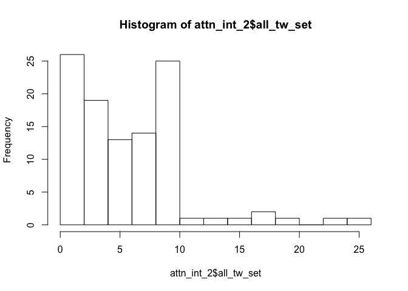<!-- -->

```r
hist(log(attn_int_2$all_tw_set))
```

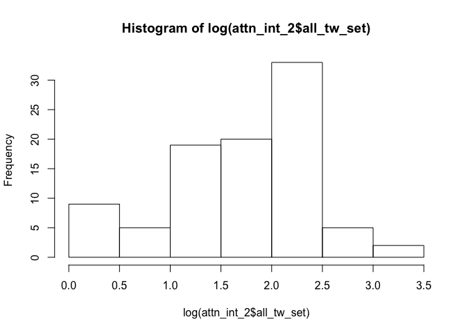<!-- -->

```r
#These data look way better when normalized with log
library(ggplot2)


#reordering for plotting: 
      attn_int_2$first_stim <- factor(attn_int_2$first_stim,levels = c("Ts" ,"T1c", "T2c" , "De","Rt" , "Ra" , "Rra"),ordered = TRUE)
      
#perhaps best order is: Ts, T, Tc, Rt, Rra, Ra, De, can do using relevel() commands from above

      #plots
      library(plotly)
      #attn_int_2$md_lg_tw_set<- attn_int_2$md_tw_set + attn_int_2$lg_tw_set
#with logged +1 (for zero) data
p <- ggplot(data = attn_int_2, aes(x = first_stim, y = log(all_tw_set+1), fill=first_stim))
p <- p + geom_boxplot()
p <- p + geom_point(position = position_jitter(width = 0.1))
p <- p + theme(axis.text.x = element_text(angle = 90), legend.position = "none") #format x-axis, and remove side legend
p <- p + xlab("Acoustic stimuli")
p <- p + ylab("log( twitches in first set + 1)")
p
```

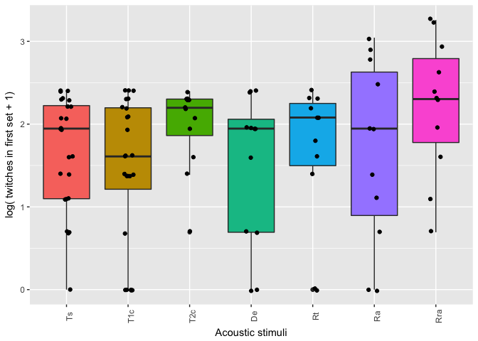<!-- -->

```r
gg<-ggplotly(p)

#look at dots and textures or whatever

#with unlogged data
p <- ggplot(data = attn_int_2, aes(x = first_stim, y = all_tw_set, fill=first_stim))
p <- p + geom_boxplot()
p <- p + theme(axis.text.x = element_text(angle = 90))
p <- p + ylab("twitches in first set")
p + xlab("Acoustic stimuli")
```

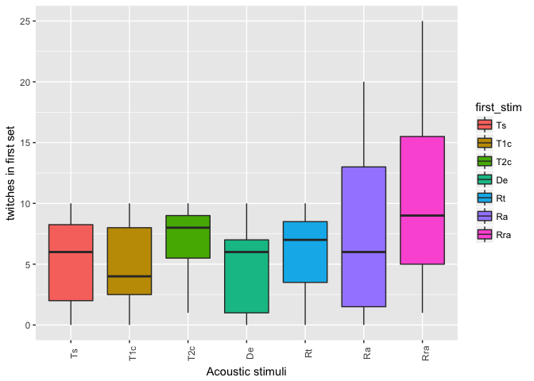<!-- -->

```r
p
```

<!-- -->

# Habituation

## Code and models: 


1) a Generalized linear mixed model is better than a general linear mixed model, bc this is technically "count" data and it seems to follow more of a poisson distribution than a normal distribution, dispite the large number of cases. 
2) Use model selection to  formally see whether adding trial number and bat ID as random effects makes the model better, not to mention the relationship between call number and trial name. Would also be good to try trial number as a fixed effect.  

all possible models proposed are built on "substantive sense" based on what is logical in this test, then using AIC and stepwise selection to see which add explanatory power.

* blind stepwise model selection isn't always a good idea, has a tendency to choose more parameterized models. I should start with common sense (why do I think these variables are important?), and then make a few models and then compare them, using AIC, for example. Most likely they won't be radically different
#Possible models:

      #1. twitches ~ call num + call_num:trial_name , random = bat_ID  # main effect of call number and interaction of call and trial, one random
      
      #2. twitches ~ call num + call_num:trial_name , random = bat_ID , trial_number (nested in bat_ID)   # this would remove trial name in and of itself had an impact on twitch number
      #3.  twitches ~ call_num * trial_name random = bat_ID 
      #4.  twitches ~ call_num * trial_name random = bat_ID , trial_number (nested in bat_ID)
      #5.  twitches ~ call_num * trial_name + trial_number random  = bat_ID  #fullest model I think, trial # as main effect 

      #6. all_tw_call ~ call_num*trial_name_2, random = list(Bat_ID=~1 , trial_number= ~1), data= attn_habit_3


```r
#make models
#
#attn_habit_3<-read.table("/Users/maydixon/GitHub/Attn_Project/Attn_project_github/attn_habit_1.txt", sep="\t", header=TRUE) #local
#or
attn_habit_3<-read.table("https://raw.githubusercontent.com/maydixon/Attn_Project/master/attn_habit_1.txt", sep="\t", header=TRUE) #web
library(nlme)
library(lme4)
d<- attn_habit_3 
head(d)
```

```
##   Bat_ID bat_name video_ID trial_name trial_name_2 primary_stim first_stim
## 1  Bat10    Insor M2U02307  rt_rra_rt    rt_rra_rt           rt         rt
## 2  Bat10    Insor M2U02307  rt_rra_rt    rt_rra_rt           rt         rt
## 3  Bat10    Insor M2U02307  rt_rra_rt    rt_rra_rt           rt         rt
## 4  Bat10    Insor M2U02307  rt_rra_rt    rt_rra_rt           rt         rt
## 5  Bat10    Insor M2U02307  rt_rra_rt    rt_rra_rt           rt         rt
## 6  Bat10    Insor M2U02307  rt_rra_rt    rt_rra_rt           rt         rt
##   trial_number sm_tw_trial md_tw_trial lg_tw_trial Orienting_trial
## 1            1           9           7           0               0
## 2            1           9           7           0               0
## 3            1           9           7           0               0
## 4            1           9           7           0               0
## 5            1           9           7           0               0
## 6            1           9           7           0               0
##   Flying_trial Approach_trial Grooming_trial Landing_trial Yawning_trial
## 1            0              0              0             0             0
## 2            0              0              0             0             0
## 3            0              0              0             0             0
## 4            0              0              0             0             0
## 5            0              0              0             0             0
## 6            0              0              0             0             0
##   set_num sm_tw_set md_tw__set lg_tw_set mdlg_tw_set all_tw_set
## 1       1         3          0         0           0          3
## 2       1         3          0         0           0          3
## 3       1         3          0         0           0          3
## 4       1         3          0         0           0          3
## 5       1         3          0         0           0          3
## 6       2         0          0         0           0          0
##   Orienting_set Flying_set Approach_set Grooming_set Landing_set
## 1             0          0            0            0           0
## 2             0          0            0            0           0
## 3             0          0            0            0           0
## 4             0          0            0            0           0
## 5             0          0            0            0           0
## 6             0          0            0            0           0
##   Yawning_set call_num Flying_call Grooming_call sm_tw_call md_tw_call
## 1           0      1.1           0             0          1          0
## 2           0      1.2           0             0          1          0
## 3           0      1.3           0             0          1          0
## 4           0      1.4           0             0          0          0
## 5           0      1.5           0             0          0          0
## 6           0      2.1           0             0          0          0
##   lg_tw_call mdlg_tw_call all_tw_call Orienting_call Approach_call
## 1          0            0           1              0             0
## 2          0            0           1              0             0
## 3          0            0           1              0             0
## 4          0            0           0              0             0
## 5          0            0           0              0             0
## 6          0            0           0              0             0
##   Landing_call Yawning_call
## 1            0            0
## 2            0            0
## 3            0            0
## 4            0            0
## 5            0            0
## 6            0            0
```

```r
 #1 twitches ~ call num + call_num:trial_name , random = bat_ID  # main effect of call number and interaction of call and trial, one random
m1<- glmer(all_tw_call ~ call_num + call_num:trial_name_2 + (1|Bat_ID), data= attn_habit_3, family="poisson")
sm1<- summary(m1)
sm1
```

```
## Generalized linear mixed model fit by maximum likelihood (Laplace
##   Approximation) [glmerMod]
##  Family: poisson  ( log )
## Formula: all_tw_call ~ call_num + call_num:trial_name_2 + (1 | Bat_ID)
##    Data: attn_habit_3
## 
##      AIC      BIC   logLik deviance df.resid 
##   6087.9   6153.8  -3032.9   6065.9     2959 
## 
## Scaled residuals: 
##     Min      1Q  Median      3Q     Max 
## -1.4371 -0.6411 -0.3472  0.4527 13.3137 
## 
## Random effects:
##  Groups Name        Variance Std.Dev.
##  Bat_ID (Intercept) 0.3419   0.5847  
## Number of obs: 2970, groups:  Bat_ID, 11
## 
## Fixed effects:
##                                   Estimate Std. Error z value Pr(>|z|)    
## (Intercept)                       0.212152   0.183768   1.154    0.248    
## call_num                         -0.087378   0.021527  -4.059 4.93e-05 ***
## call_num:trial_name_2ra_t_ra     -0.428961   0.037161 -11.543  < 2e-16 ***
## call_num:trial_name_2rra_rt_rra  -0.261421   0.029401  -8.891  < 2e-16 ***
## call_num:trial_name_2rt_rra_rt   -0.115119   0.027377  -4.205 2.61e-05 ***
## call_num:trial_name_2t_de_t      -0.071291   0.025945  -2.748    0.006 ** 
## call_num:trial_name_2t_ra_t      -0.126208   0.027766  -4.545 5.48e-06 ***
## call_num:trial_name_2tc_ts_tc     0.001175   0.023917   0.049    0.961    
## call_num:trial_name_2tia_tib_tia -0.103051   0.022521  -4.576 4.74e-06 ***
## call_num:trial_name_2ts_tc_ts    -0.133837   0.028039  -4.773 1.81e-06 ***
## ---
## Signif. codes:  0 '***' 0.001 '**' 0.01 '*' 0.05 '.' 0.1 ' ' 1
## 
## Correlation of Fixed Effects:
##                     (Intr) cll_nm cll_nm:trl_nm_2r_t_ cll_nm:trl_nm_2rr__
## call_num            -0.168                                               
## cll_nm:trl_nm_2r_t_ -0.022 -0.308                                        
## cll_nm:trl_nm_2rr__ -0.014 -0.420  0.267                                 
## cll_nm:trl_nm_2rt__ -0.008 -0.469  0.284               0.358             
## cll_nm:trl_nm_2t_d_ -0.005 -0.502  0.299               0.377             
## cll_nm:trl_nm_2t_r_ -0.008 -0.461  0.280               0.353             
## cll_nm:trl_nm_2tc__  0.000 -0.557  0.323               0.408             
## cll_nm:trl_nm_2t_t_ -0.008 -0.573  0.345               0.435             
## cll_nm:trl_nm_2ts__ -0.009 -0.455  0.278               0.349             
##                     cll_nm:trl_nm_2rt__ cll_nm:trl_nm_2t_d_
## call_num                                                   
## cll_nm:trl_nm_2r_t_                                        
## cll_nm:trl_nm_2rr__                                        
## cll_nm:trl_nm_2rt__                                        
## cll_nm:trl_nm_2t_d_  0.404                                 
## cll_nm:trl_nm_2t_r_  0.378               0.399             
## cll_nm:trl_nm_2tc__  0.438               0.462             
## cll_nm:trl_nm_2t_t_  0.466               0.491             
## cll_nm:trl_nm_2ts__  0.374               0.395             
##                     cll_nm:trl_nm_2t_r_ cll_nm:trl_nm_2tc__
## call_num                                                   
## cll_nm:trl_nm_2r_t_                                        
## cll_nm:trl_nm_2rr__                                        
## cll_nm:trl_nm_2rt__                                        
## cll_nm:trl_nm_2t_d_                                        
## cll_nm:trl_nm_2t_r_                                        
## cll_nm:trl_nm_2tc__  0.432                                 
## cll_nm:trl_nm_2t_t_  0.459               0.532             
## cll_nm:trl_nm_2ts__  0.369               0.428             
##                     cll_nm:trl_nm_2t_t_
## call_num                               
## cll_nm:trl_nm_2r_t_                    
## cll_nm:trl_nm_2rr__                    
## cll_nm:trl_nm_2rt__                    
## cll_nm:trl_nm_2t_d_                    
## cll_nm:trl_nm_2t_r_                    
## cll_nm:trl_nm_2tc__                    
## cll_nm:trl_nm_2t_t_                    
## cll_nm:trl_nm_2ts__  0.455
```

```r
#2. twitches ~ call num + call_num:trial_name , random = bat_ID , trial_number (nested in bat_ID)   # this would remove trial name in and of itself had an impact on twitch number
m2<- glmer(all_tw_call ~ call_num + call_num:trial_name_2 + (trial_number| Bat_ID), data= attn_habit_3, family="poisson")
summary(m2)
```

```
## Generalized linear mixed model fit by maximum likelihood (Laplace
##   Approximation) [glmerMod]
##  Family: poisson  ( log )
## Formula: all_tw_call ~ call_num + call_num:trial_name_2 + (trial_number |  
##     Bat_ID)
##    Data: attn_habit_3
## 
##      AIC      BIC   logLik deviance df.resid 
##   5920.9   5998.8  -2947.4   5894.9     2957 
## 
## Scaled residuals: 
##     Min      1Q  Median      3Q     Max 
## -1.4306 -0.6148 -0.3059  0.3931 14.3343 
## 
## Random effects:
##  Groups Name         Variance Std.Dev. Corr
##  Bat_ID (Intercept)  0.08022  0.2832       
##         trial_number 0.02437  0.1561   0.35
## Number of obs: 2970, groups:  Bat_ID, 11
## 
## Fixed effects:
##                                   Estimate Std. Error z value Pr(>|z|)    
## (Intercept)                       0.842494   0.151436   5.563 2.65e-08 ***
## call_num                         -0.074555   0.022064  -3.379 0.000727 ***
## call_num:trial_name_2ra_t_ra     -0.458474   0.037832 -12.119  < 2e-16 ***
## call_num:trial_name_2rra_rt_rra  -0.270345   0.031209  -8.663  < 2e-16 ***
## call_num:trial_name_2rt_rra_rt   -0.139640   0.029471  -4.738 2.16e-06 ***
## call_num:trial_name_2t_de_t      -0.101999   0.026480  -3.852 0.000117 ***
## call_num:trial_name_2t_ra_t      -0.132239   0.027885  -4.742 2.11e-06 ***
## call_num:trial_name_2tc_ts_tc    -0.003345   0.026440  -0.127 0.899314    
## call_num:trial_name_2tia_tib_tia -0.116247   0.024563  -4.733 2.22e-06 ***
## call_num:trial_name_2ts_tc_ts    -0.143387   0.029514  -4.858 1.18e-06 ***
## ---
## Signif. codes:  0 '***' 0.001 '**' 0.01 '*' 0.05 '.' 0.1 ' ' 1
## 
## Correlation of Fixed Effects:
##                     (Intr) cll_nm cll_nm:trl_nm_2r_t_ cll_nm:trl_nm_2rr__
## call_num            -0.173                                               
## cll_nm:trl_nm_2r_t_  0.020 -0.275                                        
## cll_nm:trl_nm_2rr__ -0.113 -0.448  0.208                                 
## cll_nm:trl_nm_2rt__ -0.139 -0.475  0.221               0.417             
## cll_nm:trl_nm_2t_d_ -0.052 -0.474  0.287               0.359             
## cll_nm:trl_nm_2t_r_  0.023 -0.440  0.290               0.310             
## cll_nm:trl_nm_2tc__ -0.042 -0.585  0.258               0.454             
## cll_nm:trl_nm_2t_t_  0.018 -0.594  0.295               0.451             
## cll_nm:trl_nm_2ts__  0.001 -0.483  0.248               0.366             
##                     cll_nm:trl_nm_2rt__ cll_nm:trl_nm_2t_d_
## call_num                                                   
## cll_nm:trl_nm_2r_t_                                        
## cll_nm:trl_nm_2rr__                                        
## cll_nm:trl_nm_2rt__                                        
## cll_nm:trl_nm_2t_d_  0.401                                 
## cll_nm:trl_nm_2t_r_  0.322               0.383             
## cll_nm:trl_nm_2tc__  0.443               0.390             
## cll_nm:trl_nm_2t_t_  0.439               0.420             
## cll_nm:trl_nm_2ts__  0.367               0.346             
##                     cll_nm:trl_nm_2t_r_ cll_nm:trl_nm_2tc__
## call_num                                                   
## cll_nm:trl_nm_2r_t_                                        
## cll_nm:trl_nm_2rr__                                        
## cll_nm:trl_nm_2rt__                                        
## cll_nm:trl_nm_2t_d_                                        
## cll_nm:trl_nm_2t_r_                                        
## cll_nm:trl_nm_2tc__  0.378                                 
## cll_nm:trl_nm_2t_t_  0.414               0.596             
## cll_nm:trl_nm_2ts__  0.349               0.484             
##                     cll_nm:trl_nm_2t_t_
## call_num                               
## cll_nm:trl_nm_2r_t_                    
## cll_nm:trl_nm_2rr__                    
## cll_nm:trl_nm_2rt__                    
## cll_nm:trl_nm_2t_d_                    
## cll_nm:trl_nm_2t_r_                    
## cll_nm:trl_nm_2tc__                    
## cll_nm:trl_nm_2t_t_                    
## cll_nm:trl_nm_2ts__  0.506
```

```r
sm2<- summary(m2)
#2.5 #this adds call number as a main effect, but doesn't include the main effect of trial type
m2_5<- glmer(all_tw_call ~ call_num + call_num:trial_name_2 + trial_number + (1| Bat_ID), data= attn_habit_3, family="poisson")
sm25<- summary(m2_5)
sm25
```

```
## Generalized linear mixed model fit by maximum likelihood (Laplace
##   Approximation) [glmerMod]
##  Family: poisson  ( log )
## Formula: all_tw_call ~ call_num + call_num:trial_name_2 + trial_number +  
##     (1 | Bat_ID)
##    Data: attn_habit_3
## 
##      AIC      BIC   logLik deviance df.resid 
##   5986.9   6058.8  -2981.4   5962.9     2958 
## 
## Scaled residuals: 
##     Min      1Q  Median      3Q     Max 
## -1.5225 -0.6337 -0.3505  0.4694 12.8311 
## 
## Random effects:
##  Groups Name        Variance Std.Dev.
##  Bat_ID (Intercept) 0.3376   0.581   
## Number of obs: 2970, groups:  Bat_ID, 11
## 
## Fixed effects:
##                                   Estimate Std. Error z value Pr(>|z|)    
## (Intercept)                       0.627926   0.186791   3.362 0.000775 ***
## call_num                         -0.073633   0.021515  -3.422 0.000621 ***
## trial_number                     -0.080078   0.007964 -10.055  < 2e-16 ***
## call_num:trial_name_2ra_t_ra     -0.418943   0.036945 -11.340  < 2e-16 ***
## call_num:trial_name_2rra_rt_rra  -0.309132   0.030018 -10.298  < 2e-16 ***
## call_num:trial_name_2rt_rra_rt   -0.165082   0.028074  -5.880 4.10e-09 ***
## call_num:trial_name_2t_de_t      -0.097848   0.026135  -3.744 0.000181 ***
## call_num:trial_name_2t_ra_t      -0.119508   0.027656  -4.321 1.55e-05 ***
## call_num:trial_name_2tc_ts_tc    -0.019143   0.024121  -0.794 0.427414    
## call_num:trial_name_2tia_tib_tia -0.104544   0.022544  -4.637 3.53e-06 ***
## call_num:trial_name_2ts_tc_ts    -0.132608   0.028009  -4.734 2.20e-06 ***
## ---
## Signif. codes:  0 '***' 0.001 '**' 0.01 '*' 0.05 '.' 0.1 ' ' 1
## 
## Correlation of Fixed Effects:
##                     (Intr) cll_nm trl_nm cll_nm:trl_nm_2r_t_
## call_num            -0.150                                  
## trial_numbr         -0.208 -0.071                           
## cll_nm:trl_nm_2r_t_ -0.019 -0.308 -0.015                    
## cll_nm:trl_nm_2rr__ -0.049 -0.415  0.158  0.258             
## cll_nm:trl_nm_2rt__ -0.050 -0.463  0.188  0.274             
## cll_nm:trl_nm_2t_d_ -0.030 -0.500  0.112  0.295             
## cll_nm:trl_nm_2t_r_ -0.003 -0.460 -0.020  0.282             
## cll_nm:trl_nm_2tc__ -0.020 -0.557  0.094  0.318             
## cll_nm:trl_nm_2t_t_ -0.010 -0.574  0.010  0.344             
## cll_nm:trl_nm_2ts__ -0.007 -0.456 -0.005  0.278             
##                     cll_nm:trl_nm_2rr__ cll_nm:trl_nm_2rt__
## call_num                                                   
## trial_numbr                                                
## cll_nm:trl_nm_2r_t_                                        
## cll_nm:trl_nm_2rr__                                        
## cll_nm:trl_nm_2rt__  0.374                                 
## cll_nm:trl_nm_2t_d_  0.382               0.411             
## cll_nm:trl_nm_2t_r_  0.341               0.364             
## cll_nm:trl_nm_2tc__  0.413               0.442             
## cll_nm:trl_nm_2t_t_  0.428               0.456             
## cll_nm:trl_nm_2ts__  0.343               0.365             
##                     cll_nm:trl_nm_2t_d_ cll_nm:trl_nm_2t_r_
## call_num                                                   
## trial_numbr                                                
## cll_nm:trl_nm_2r_t_                                        
## cll_nm:trl_nm_2rr__                                        
## cll_nm:trl_nm_2rt__                                        
## cll_nm:trl_nm_2t_d_                                        
## cll_nm:trl_nm_2t_r_  0.393                                 
## cll_nm:trl_nm_2tc__  0.462               0.425             
## cll_nm:trl_nm_2t_t_  0.485               0.458             
## cll_nm:trl_nm_2ts__  0.389               0.369             
##                     cll_nm:trl_nm_2tc__ cll_nm:trl_nm_2t_t_
## call_num                                                   
## trial_numbr                                                
## cll_nm:trl_nm_2r_t_                                        
## cll_nm:trl_nm_2rr__                                        
## cll_nm:trl_nm_2rt__                                        
## cll_nm:trl_nm_2t_d_                                        
## cll_nm:trl_nm_2t_r_                                        
## cll_nm:trl_nm_2tc__                                        
## cll_nm:trl_nm_2t_t_  0.533                                 
## cll_nm:trl_nm_2ts__  0.427               0.458
```

```r
#past here model fails to converge

#3.  twitches ~ call_num * trial_name random = bat_ID 
m3<- glmer(all_tw_call ~ call_num *trial_name_2  + (1| Bat_ID), data= attn_habit_3, family="poisson")
```

```
## Warning in checkConv(attr(opt, "derivs"), opt$par, ctrl = control
## $checkConv, : Model failed to converge with max|grad| = 0.00176938 (tol =
## 0.001, component 1)
```

```r
#4.  twitches ~ call_num * trial_name random = bat_ID , trial_number (nested in bat_ID)
m4<- glmer(all_tw_call ~ call_num *trial_name_2  + (trial_number| Bat_ID), data= attn_habit_3, family="poisson")
```

```
## Warning in checkConv(attr(opt, "derivs"), opt$par, ctrl = control
## $checkConv, : Model failed to converge with max|grad| = 0.00241272 (tol =
## 0.001, component 1)
```

```r
#5 twitches ~ call_num * trial_name + trial_number random  = bat_ID  #fullest model I think, trial # as main effect ((WHICH HAS LOWEST AIC?, WHICH MAKES MOST SENSE))
m5<- glmer(all_tw_call ~ call_num *trial_name_2 +trial_number + (1| Bat_ID), data= attn_habit_3, family="poisson") 
```

```
## Warning in checkConv(attr(opt, "derivs"), opt$par, ctrl = control
## $checkConv, : Model failed to converge with max|grad| = 0.00154573 (tol =
## 0.001, component 1)
```

Ok, so we know that more complex models, any that include trial_name trial_name as a main effect fail to converge. So which of the three models (m1, m2, and m2_5) explains the data best?

I can 1) quickly look at the relative AIC's of each model. The lower AIC's are liable to be better. 2) run partial F tests to test more full models to more reduced models. 

Comparing AIC:

```r
#comparing AIC's of each model
AIC_comp<-cbind(sm1$AICtab, sm2$AICtab, sm25$AICtab)
colnames(AIC_comp)<-(c("sm1", "sm2", "sm25"))
AIC_comp
```

```
##                sm1       sm2      sm25
## AIC       6087.877  5920.891  5986.893
## BIC       6153.836  5998.843  6058.849
## logLik   -3032.938 -2947.446 -2981.447
## deviance  6065.877  5894.891  5962.893
## df.resid  2959.000  2957.000  2958.000
```

So model 2 has the lowest AIC. Is it significantly better? Can run a partial F test: 

```r
#nested F test to test models. 
anova(m2_5, m2,  test="F") #compares the reduced model trial name as a random factor to full model with trial_name as main effect
```

```
## Data: attn_habit_3
## Models:
## m2_5: all_tw_call ~ call_num + call_num:trial_name_2 + trial_number + 
## m2_5:     (1 | Bat_ID)
## m2: all_tw_call ~ call_num + call_num:trial_name_2 + (trial_number | 
## m2:     Bat_ID)
##      Df    AIC    BIC  logLik deviance  Chisq Chi Df Pr(>Chisq)    
## m2_5 12 5986.9 6058.8 -2981.4   5962.9                             
## m2   13 5920.9 5998.8 -2947.4   5894.9 68.002      1  < 2.2e-16 ***
## ---
## Signif. codes:  0 '***' 0.001 '**' 0.01 '*' 0.05 '.' 0.1 ' ' 1
```

```r
# I think that this shows that model 2 has more explanatory power
anova(m1, m2, test = "F")
```

```
## Data: attn_habit_3
## Models:
## m1: all_tw_call ~ call_num + call_num:trial_name_2 + (1 | Bat_ID)
## m2: all_tw_call ~ call_num + call_num:trial_name_2 + (trial_number | 
## m2:     Bat_ID)
##    Df    AIC    BIC  logLik deviance  Chisq Chi Df Pr(>Chisq)    
## m1 11 6087.9 6153.8 -3032.9   6065.9                             
## m2 13 5920.9 5998.8 -2947.4   5894.9 170.99      2  < 2.2e-16 ***
## ---
## Signif. codes:  0 '***' 0.001 '**' 0.01 '*' 0.05 '.' 0.1 ' ' 1
```

```r
# model 2 has the most explanatory power. 
```

So, it seems that model #2 explains the data best: [ twitches ~ call num + call_num:trial_name , random = bat_ID , trial_number (nested in bat_ID) ]


That said, what does model 2 tell us? 


```r
sm2
```

```
## Generalized linear mixed model fit by maximum likelihood (Laplace
##   Approximation) [glmerMod]
##  Family: poisson  ( log )
## Formula: all_tw_call ~ call_num + call_num:trial_name_2 + (trial_number |  
##     Bat_ID)
##    Data: attn_habit_3
## 
##      AIC      BIC   logLik deviance df.resid 
##   5920.9   5998.8  -2947.4   5894.9     2957 
## 
## Scaled residuals: 
##     Min      1Q  Median      3Q     Max 
## -1.4306 -0.6148 -0.3059  0.3931 14.3343 
## 
## Random effects:
##  Groups Name         Variance Std.Dev. Corr
##  Bat_ID (Intercept)  0.08022  0.2832       
##         trial_number 0.02437  0.1561   0.35
## Number of obs: 2970, groups:  Bat_ID, 11
## 
## Fixed effects:
##                                   Estimate Std. Error z value Pr(>|z|)    
## (Intercept)                       0.842494   0.151436   5.563 2.65e-08 ***
## call_num                         -0.074555   0.022064  -3.379 0.000727 ***
## call_num:trial_name_2ra_t_ra     -0.458474   0.037832 -12.119  < 2e-16 ***
## call_num:trial_name_2rra_rt_rra  -0.270345   0.031209  -8.663  < 2e-16 ***
## call_num:trial_name_2rt_rra_rt   -0.139640   0.029471  -4.738 2.16e-06 ***
## call_num:trial_name_2t_de_t      -0.101999   0.026480  -3.852 0.000117 ***
## call_num:trial_name_2t_ra_t      -0.132239   0.027885  -4.742 2.11e-06 ***
## call_num:trial_name_2tc_ts_tc    -0.003345   0.026440  -0.127 0.899314    
## call_num:trial_name_2tia_tib_tia -0.116247   0.024563  -4.733 2.22e-06 ***
## call_num:trial_name_2ts_tc_ts    -0.143387   0.029514  -4.858 1.18e-06 ***
## ---
## Signif. codes:  0 '***' 0.001 '**' 0.01 '*' 0.05 '.' 0.1 ' ' 1
## 
## Correlation of Fixed Effects:
##                     (Intr) cll_nm cll_nm:trl_nm_2r_t_ cll_nm:trl_nm_2rr__
## call_num            -0.173                                               
## cll_nm:trl_nm_2r_t_  0.020 -0.275                                        
## cll_nm:trl_nm_2rr__ -0.113 -0.448  0.208                                 
## cll_nm:trl_nm_2rt__ -0.139 -0.475  0.221               0.417             
## cll_nm:trl_nm_2t_d_ -0.052 -0.474  0.287               0.359             
## cll_nm:trl_nm_2t_r_  0.023 -0.440  0.290               0.310             
## cll_nm:trl_nm_2tc__ -0.042 -0.585  0.258               0.454             
## cll_nm:trl_nm_2t_t_  0.018 -0.594  0.295               0.451             
## cll_nm:trl_nm_2ts__  0.001 -0.483  0.248               0.366             
##                     cll_nm:trl_nm_2rt__ cll_nm:trl_nm_2t_d_
## call_num                                                   
## cll_nm:trl_nm_2r_t_                                        
## cll_nm:trl_nm_2rr__                                        
## cll_nm:trl_nm_2rt__                                        
## cll_nm:trl_nm_2t_d_  0.401                                 
## cll_nm:trl_nm_2t_r_  0.322               0.383             
## cll_nm:trl_nm_2tc__  0.443               0.390             
## cll_nm:trl_nm_2t_t_  0.439               0.420             
## cll_nm:trl_nm_2ts__  0.367               0.346             
##                     cll_nm:trl_nm_2t_r_ cll_nm:trl_nm_2tc__
## call_num                                                   
## cll_nm:trl_nm_2r_t_                                        
## cll_nm:trl_nm_2rr__                                        
## cll_nm:trl_nm_2rt__                                        
## cll_nm:trl_nm_2t_d_                                        
## cll_nm:trl_nm_2t_r_                                        
## cll_nm:trl_nm_2tc__  0.378                                 
## cll_nm:trl_nm_2t_t_  0.414               0.596             
## cll_nm:trl_nm_2ts__  0.349               0.484             
##                     cll_nm:trl_nm_2t_t_
## call_num                               
## cll_nm:trl_nm_2r_t_                    
## cll_nm:trl_nm_2rr__                    
## cll_nm:trl_nm_2rt__                    
## cll_nm:trl_nm_2t_d_                    
## cll_nm:trl_nm_2t_r_                    
## cll_nm:trl_nm_2tc__                    
## cll_nm:trl_nm_2t_t_                    
## cll_nm:trl_nm_2ts__  0.506
```

```r
sm2$coefficients
```

```
##                                      Estimate Std. Error     z value
## (Intercept)                       0.842494144 0.15143624   5.5633587
## call_num                         -0.074555355 0.02206409  -3.3790361
## call_num:trial_name_2ra_t_ra     -0.458474431 0.03783237 -12.1185746
## call_num:trial_name_2rra_rt_rra  -0.270345314 0.03120861  -8.6625244
## call_num:trial_name_2rt_rra_rt   -0.139639614 0.02947086  -4.7382268
## call_num:trial_name_2t_de_t      -0.101998721 0.02647972  -3.8519568
## call_num:trial_name_2t_ra_t      -0.132239299 0.02788460  -4.7423772
## call_num:trial_name_2tc_ts_tc    -0.003345435 0.02644034  -0.1265277
## call_num:trial_name_2tia_tib_tia -0.116246817 0.02456344  -4.7325147
## call_num:trial_name_2ts_tc_ts    -0.143387174 0.02951376  -4.8583158
##                                      Pr(>|z|)
## (Intercept)                      2.646312e-08
## call_num                         7.274047e-04
## call_num:trial_name_2ra_t_ra     8.421101e-34
## call_num:trial_name_2rra_rt_rra  4.614301e-18
## call_num:trial_name_2rt_rra_rt   2.155964e-06
## call_num:trial_name_2t_de_t      1.171777e-04
## call_num:trial_name_2t_ra_t      2.112249e-06
## call_num:trial_name_2tc_ts_tc    8.993142e-01
## call_num:trial_name_2tia_tib_tia 2.217553e-06
## call_num:trial_name_2ts_tc_ts    1.183885e-06
```

```r
sm2$coefficients[1,1]
```

```
## [1] 0.8424941
```
This is the estimate for the slope of responses to dendropsophes. It is different than tungara complex, but not different than anything else

So, the way to interpret this is: 
The *intercept* is the number of twitches at call 0, for whatever the reference is. Pretty similar for all the treatments. 
The *slope* value for call number is the main effect of change in the number of twitches with time, with all the differences compared against the reference value. 

To find the slopes of each of the other treatments and how they differ from call number, add the interaction effect to the effect for call number to get the true value. Relevel to get the one that is the current reference. 

To see whether there is a significant difference between treatments, relevel, and see what the values are. These are kind of complicated with glmm, so don't read into them everything. 

This is a sheet with a summary of the slopes of the results:


```r
#making a little sheet to store results # Don't run again, I just scrolled through manually
#tmts<- c("call_num", "de", "ra", "rra", "rt", "t_de", "t_ra", "tc", "tia", "ts")
attn_habit_3$trial_name_2 <- relevel(attn_habit_3$trial_name_2,"de_t_de") #MAKE DE REFERENCE
m2<- glmer(all_tw_call ~ call_num + call_num:trial_name_2 + (trial_number| Bat_ID), data= attn_habit_3, family="poisson") #run model
sm2<- summary(m2)  #make summary
slope_coeff<- c(sm2$coefficients[,1]) #grab row with the coefficients
slope_est <- slope_coeff + (sm2$coefficients[2,1]) #add the interactions to call# coeff
slopes <- cbind(slope_coeff, slope_est) #make into a sheet
slopes<- slopes[3:10,] #remove the first two rows that don't make sense
attn_habit_3$trial_name_2 <- relevel(attn_habit_3$trial_name_2,"ra_t_ra") #MAKE RA REFERENCE so that DE interaction coefficients show in output
m2a<- glmer(all_tw_call ~ call_num + call_num:trial_name_2 + (trial_number| Bat_ID), data= attn_habit_3, family="poisson") #run model again
sm2a<- summary(m2a)  #make summary
de_coeff_est<-  c(sm2a$coefficients[3,1]) #pull de coefficient
de_slope_est<- de_coeff_est+ sm2a$coefficients[2,1]  #add call num to de coefficient
de_row<- cbind(de_coeff_est, de_slope_est) #put into row
slopes<-rbind(slopes, de_row) #add de row to rest of it 
rownames(slopes) [9] <- "call_num:trial_name_2de_t_de" #add the de row name

slopes #returns the slope estimations (in the second row, for each of the treatments)
```

```
##                                   slope_coeff   slope_est
## call_num:trial_name_2ra_t_ra     -0.458474431 -0.53302979
## call_num:trial_name_2rra_rt_rra  -0.270345314 -0.34490067
## call_num:trial_name_2rt_rra_rt   -0.139639614 -0.21419497
## call_num:trial_name_2t_de_t      -0.101998721 -0.17655408
## call_num:trial_name_2t_ra_t      -0.132239299 -0.20679465
## call_num:trial_name_2tc_ts_tc    -0.003345435 -0.07790079
## call_num:trial_name_2tia_tib_tia -0.116246817 -0.19080217
## call_num:trial_name_2ts_tc_ts    -0.143387174 -0.21794253
## call_num:trial_name_2de_t_de      0.458477024 -0.07455406
```

```r
 #So, which are significantly different?
 #copying and pasting into an excel doc. 
```

This is s series of "relevels" to show which slopes are significantly different from each other according to this model. To run, simply run the line with the relevel function of the treatment you would like to make reference, and then run the line with the model and summary: 

```r
#relevel lines
#DE as reference:
attn_habit_3$trial_name_2 <- relevel(attn_habit_3$trial_name_2,"de_t_de") 
#RA as reference: 
attn_habit_3$trial_name_2 <- relevel(attn_habit_3$trial_name_2,"ra_t_ra") 
#RRA as reference:
attn_habit_3$trial_name_2 <- relevel(attn_habit_3$trial_name_2,"rra_rt_rra") 
#TS as reference:
attn_habit_3$trial_name_2 <- relevel(attn_habit_3$trial_name_2,"ts_tc_ts") 
#TIA as reference:
attn_habit_3$trial_name_2 <- relevel(attn_habit_3$trial_name_2,"tia_tib_tia") 
#TC as reference:
attn_habit_3$trial_name_2 <- relevel(attn_habit_3$trial_name_2,"tc_ts_tc")
#T_RA as reference:
attn_habit_3$trial_name_2 <- relevel(attn_habit_3$trial_name_2,"t_ra_t")
#T_DE as reference:
attn_habit_3$trial_name_2 <- relevel(attn_habit_3$trial_name_2,"t_de_t")
#RT as reference:
attn_habit_3$trial_name_2 <- relevel(attn_habit_3$trial_name_2,"rt_rra_rt")


#model running lines:
m2<- glmer(all_tw_call ~ call_num + call_num:trial_name_2 + (trial_number| Bat_ID), data= attn_habit_3, family="poisson") #run model
sm2<- summary(m2)  #make summary
sm2
```

```
## Generalized linear mixed model fit by maximum likelihood (Laplace
##   Approximation) [glmerMod]
##  Family: poisson  ( log )
## Formula: all_tw_call ~ call_num + call_num:trial_name_2 + (trial_number |  
##     Bat_ID)
##    Data: attn_habit_3
## 
##      AIC      BIC   logLik deviance df.resid 
##   5920.9   5998.8  -2947.4   5894.9     2957 
## 
## Scaled residuals: 
##     Min      1Q  Median      3Q     Max 
## -1.4306 -0.6148 -0.3059  0.3931 14.3341 
## 
## Random effects:
##  Groups Name         Variance Std.Dev. Corr
##  Bat_ID (Intercept)  0.08022  0.2832       
##         trial_number 0.02437  0.1561   0.35
## Number of obs: 2970, groups:  Bat_ID, 11
## 
## Fixed effects:
##                                   Estimate Std. Error z value Pr(>|z|)    
## (Intercept)                       0.842516   0.151441   5.563 2.65e-08 ***
## call_num                         -0.214192   0.027152  -7.889 3.06e-15 ***
## call_num:trial_name_2t_de_t       0.037638   0.030713   1.225    0.220    
## call_num:trial_name_2t_ra_t       0.007396   0.033421   0.221    0.825    
## call_num:trial_name_2tc_ts_tc     0.136290   0.029619   4.601 4.20e-06 ***
## call_num:trial_name_2tia_tib_tia  0.023389   0.028909   0.809    0.418    
## call_num:trial_name_2ts_tc_ts    -0.003753   0.033182  -0.113    0.910    
## call_num:trial_name_2rra_rt_rra  -0.130709   0.032798  -3.985 6.74e-05 ***
## call_num:trial_name_2ra_t_ra     -0.318838   0.042518  -7.499 6.44e-14 ***
## call_num:trial_name_2de_t_de      0.139637   0.029471   4.738 2.16e-06 ***
## ---
## Signif. codes:  0 '***' 0.001 '**' 0.01 '*' 0.05 '.' 0.1 ' ' 1
## 
## Correlation of Fixed Effects:
##                     (Intr) cll_nm cll_nm:trl_nm_2t_d_ cll_nm:trl_nm_2t_r_
## call_num            -0.291                                               
## cll_nm:trl_nm_2t_d_  0.089 -0.628                                        
## cll_nm:trl_nm_2t_r_  0.141 -0.623  0.559                                 
## cll_nm:trl_nm_2tc__  0.101 -0.691  0.531               0.543             
## cll_nm:trl_nm_2t_t_  0.156 -0.717  0.575               0.589             
## cll_nm:trl_nm_2ts__  0.124 -0.616  0.497               0.516             
## cll_nm:trl_nm_2rr__  0.017 -0.544  0.465               0.448             
## cll_nm:trl_nm_2r_t_  0.114 -0.471  0.457               0.467             
## cll_nm:trl_nm_2d__   0.139 -0.699  0.614               0.613             
##                     cll_nm:trl_nm_2tc__ cll_nm:trl_nm_2t_t_
## call_num                                                   
## cll_nm:trl_nm_2t_d_                                        
## cll_nm:trl_nm_2t_r_                                        
## cll_nm:trl_nm_2tc__                                        
## cll_nm:trl_nm_2t_t_  0.692                                 
## cll_nm:trl_nm_2ts__  0.592               0.623             
## cll_nm:trl_nm_2rr__  0.530               0.541             
## cll_nm:trl_nm_2r_t_  0.425               0.470             
## cll_nm:trl_nm_2d__   0.600               0.646             
##                     cll_nm:trl_nm_2ts__ cll_nm:trl_nm_2rr__
## call_num                                                   
## cll_nm:trl_nm_2t_d_                                        
## cll_nm:trl_nm_2t_r_                                        
## cll_nm:trl_nm_2tc__                                        
## cll_nm:trl_nm_2t_t_                                        
## cll_nm:trl_nm_2ts__                                        
## cll_nm:trl_nm_2rr__  0.462                                 
## cll_nm:trl_nm_2r_t_  0.411               0.347             
## cll_nm:trl_nm_2d__   0.562               0.502             
##                     cll_nm:trl_nm_2r_t_
## call_num                               
## cll_nm:trl_nm_2t_d_                    
## cll_nm:trl_nm_2t_r_                    
## cll_nm:trl_nm_2tc__                    
## cll_nm:trl_nm_2t_t_                    
## cll_nm:trl_nm_2ts__                    
## cll_nm:trl_nm_2rr__                    
## cll_nm:trl_nm_2r_t_                    
## cll_nm:trl_nm_2d__   0.497
```

## Habituation results summary

So, the below table shows all the the treatments with their slopes, from biggest to smallest, and their tests of significant difference  tests (all ***) denoted by letters. If two treatments share a letter, they were not significantly different (1), and if they do, they were significantly different (0): 

| trial_name |	slope_coeff |	slope_est |	sig.dif
|:---------------------------|-----------|------------|-----|
| call_num:trial_name_2de_t_de |	0.45847131 |	-0.07455272 |	a |
| call_num:trial_name_2tc_ts_tc |	-0.00334758 |	-0.07790228 |a |
| call_num:trial_name_2t_de_t |	-0.10200029 |	-0.17655499 |	b |
| call_num:trial_name_2tia_tib_tia |	-0.11624862 |	-0.19080332 |	b |
| call_num:trial_name_2t_ra_t |	-0.13224066 |	-0.20679536 |	b |
| call_num:trial_name_2rt_rra_rt |	-0.13963957 |	-0.21419427 |	b |
| call_num:trial_name_2ts_tc_ts |	-0.14339025 |	-0.21794495 |	b |
| call_num:trial_name_2rra_rt_rra |	-0.27034559 |	-0.34490029 |	c |
| call_num:trial_name_2ra_t_ra |	-0.45847568 |	-0.53303038 |	d |

   *organization of this table can be found in glmer_results_summaries.xls excel sheet
   
So, the bats habituated most slowly to the DE and The TC, which makes sense, becuase each of these is quite attractive, and the bats are less likely to be habituated. No difference in the amount that they habituated to DE and TC

bats habituated to all the simpler tungaras at the same rate (sanity check)

Bats habituted to RRA very quickly, and habituated fastest to the regular rhinella alata. 

So, they did habituate fastest to calls that were less biologically relevent to them. 


## Habituation plots, various: 


```r
library(ggplot2)
    # New habituation plots (boxplots)
        
        ## can i make a plot of boxplots for each trial type, all the way across trial?
        attn_whole<-read.table("https://raw.githubusercontent.com/maydixon/Attn_Project/master/attention_Rcopy_individuals_condensed.txt", sep="\t", header=TRUE)
        attn_whole <- subset(attn_whole, attn_whole$bat_name != "Blackbeard") 
        # want just one line for each "set"
        #pull partial string match  x.1 for call number using grep
        attn_whole_set <- attn_whole[grep(".1", attn_whole$call_num), ]
        attn_whole_set_1to5 <- subset(attn_whole_set, attn_whole_set$set_num != "6" & attn_whole_set$set_num != "7") #removing last 2 sets
        
        
        #all treatments together, overall trend
        
        p_all<-ggplot(data=attn_whole_set_1to5, aes(x = set_num, group=set_num , y = all_tw_set, fill=set_num))      #
        p_all <- p_all + geom_boxplot()
        p_all <- p_all + ylab("Twitches in presentation")
        p_all <- p_all + xlab("presentation number")
        p_all <- p_all + ggtitle("All")
        p_all
```

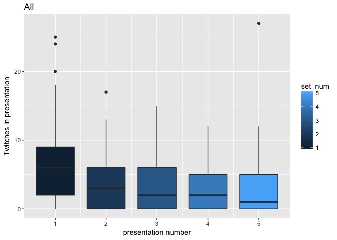<!-- -->

```r
        #making a plot for the entire of one treatment, with each set getting a boxplot
        
        #DE
        de_data<- attn_whole_set_1to5[attn_whole_set_1to5$trial_name_2=="de_t_de", ]       
        p_de <-ggplot(data=de_data, aes(x = set_num, y = all_tw_set))      
        p_de <- p_de + geom_boxplot(aes(fill=factor(set_num)))
        p_de <- p_de + guides(fill=FALSE)
        p_de <- p_de + scale_x_continuous(breaks = c(1,2,3,4,5,6,7)) +
              scale_fill_manual(breaks = c("1", "2", "3", "4", "5", "6", "7"),
                                values=c("#F966D5", "#F966D5", "#F966D5", "#F966D5", "#F966D5", "#C39921", "#F966D5"))
        p_de <- p_de + ylab("Twitches in presentation")
        p_de <- p_de + xlab("presentation number")
        p_de<- p_de + labs(title = "D. ebraccatus / P. pustulosus")
        p_de <- p_de + coord_cartesian(ylim = c(0, 25))
        p_de <- p_de + stat_smooth(colour="black", size=0.5, method="lm", se=FALSE ,  data= subset(de_data, de_data$set_num!="6" & de_data$set_num!="7")) 
        p_de
```

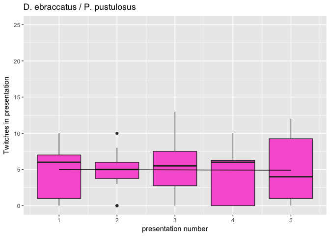<!-- -->

```r
        #try<-subset(de_data, de_data$set_num!="6" & de_data$set_num!="7")
        #View(try)
        #made using coloring advice from "http://stackoverflow.com/questions/10805643/ggplot2-add-color-to-boxplot-continuous-value-supplied-to-discrete-scale-er"
        
        
        
        
        
        ### very variable, eh? should check that
        d1<- attn_whole_set_1to5[attn_whole_set_1to5$trial_name_2=="de_t_de", ]
        plot(d1$Bat_ID, d1$all_tw_set )
```

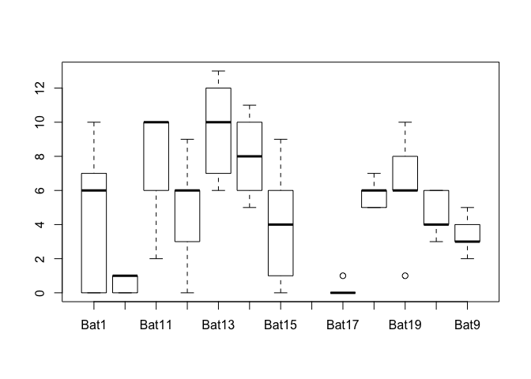<!-- -->

```r
        #for Rra
        hist(d1$all_tw_set)
```

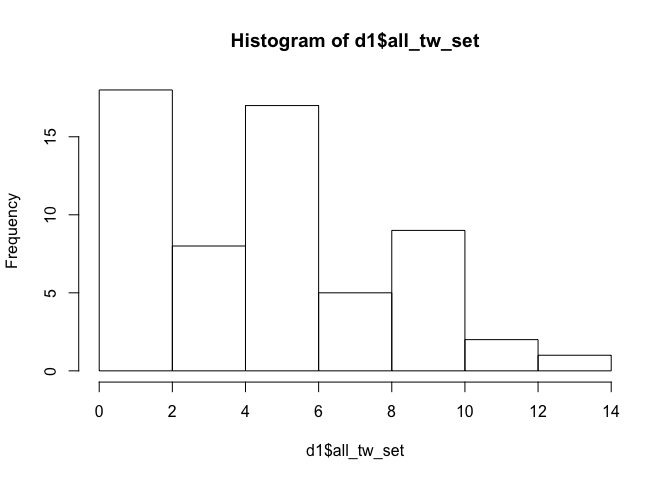<!-- -->

```r
        #t_de
        t_de_data <- attn_whole_set_1to5[attn_whole_set_1to5$trial_name_2=="t_de_t", ]
        p_t_de <-ggplot(data=t_de_data, aes(x = set_num, y = all_tw_set))      
        p_t_de <- p_t_de + geom_boxplot(aes(fill=factor(set_num)))
        p_t_de <- p_t_de + guides(fill=FALSE)
        p_t_de <- p_t_de + scale_x_continuous(breaks = c(1,2,3,4,5,6,7)) +
              scale_fill_manual(breaks = c("1", "2", "3", "4", "5", "6", "7"),
                                values=c( "#C39921", "#C39921", "#C39921", "#C39921", "#C39921", "#F966D5", "#C39921"))
        p_t_de <- p_t_de + ylab("Twitches in presentation")
        p_t_de + xlab("presentation number")
```

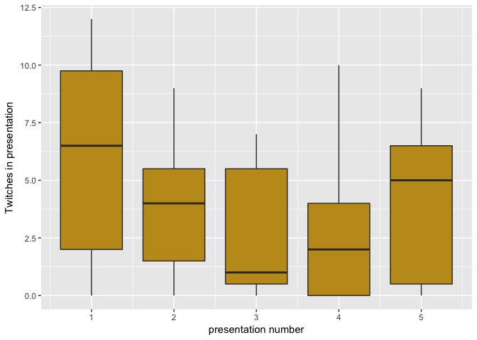<!-- -->

```r
        p_t_de <- p_t_de + xlab("presentation number")
        p_t_de<- p_t_de + labs(title = "P. pustulosus / D. ebraccatus")
        p_t_de<- p_t_de + coord_cartesian(ylim = c(0, 25))
        p_t_de <- p_t_de + stat_smooth(colour="black", size=0.5, method="lm", se=FALSE ,  data= subset(t_de_data, t_de_data$set_num!="6" & t_de_data$set_num!="7")) 
        p_t_de
```

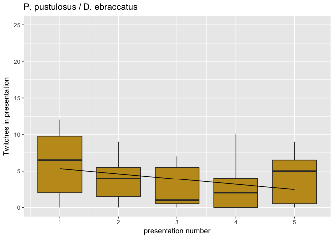<!-- -->

```r
        #rra
        rra_data<- attn_whole_set_1to5[attn_whole_set_1to5$trial_name_2=="rra_rt_rra", ]
        p_rra <-ggplot(data=rra_data, aes(x = set_num, y = all_tw_set))      
        p_rra <- p_rra + geom_boxplot(aes(fill=factor(set_num)))
        p_rra <- p_rra + guides(fill=FALSE)
        #P_rra<- p_rra + coord_cartesian(ylim = c(0, 20)
        p_rra <- p_rra + scale_x_continuous(breaks = c(1,2,3,4,5,6,7)) +
              scale_fill_manual(breaks = c("1", "2", "3", "4", "5", "6", "7"),
                                values=c( "#1EB7E9","#1EB7E9", "#1EB7E9","#1EB7E9","#1EB7E9","#1EBF95","#1EB7E9" ))
        p_rra <- p_rra + ylab("Twitches in presentation")
        p_rra + xlab("presentation number")
```

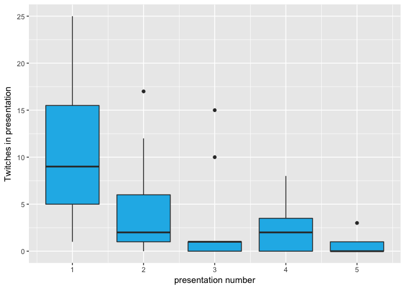<!-- -->

```r
        p_rra <- p_rra + xlab("presentation number")
        p_rra<- p_rra + labs(title="Reversed R. alata / Reversed P. pustulosus")
        p_rra<- p_rra  + coord_cartesian(ylim = c(0, 25))
        p_rra <- p_rra + stat_smooth(colour="black", size=0.5, method="lm", se=FALSE ,  data= subset(rra_data, rra_data$set_num!="6" & rra_data$set_num!="7")) 
        p_rra
```

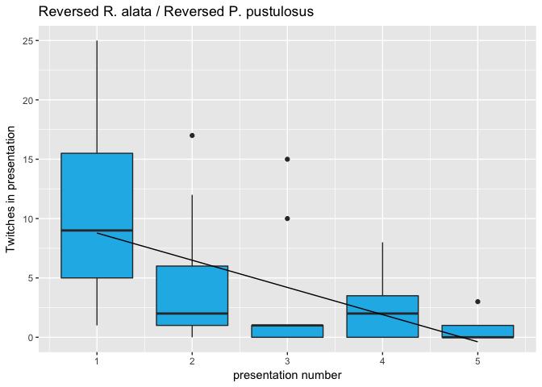<!-- -->

```r
        #ra
        ra_data<- attn_whole_set_1to5[attn_whole_set_1to5$trial_name_2=="ra_t_ra", ]
        p_ra <-ggplot(data=ra_data, aes(x = set_num, y = all_tw_set))      
        p_ra <- p_ra + geom_boxplot(aes(fill=factor(set_num)))
        p_ra <- p_ra + guides(fill=FALSE)
        p_ra <- p_ra + scale_x_continuous(breaks = c(1,2,3,4,5,6,7)) +
              scale_fill_manual(breaks = c("1", "2", "3", "4", "5", "6", "7"),
                                values=c( "#A58DFC", "#A58DFC","#A58DFC","#A58DFC","#A58DFC", "#C39921", "#A58DFC" ))
        p_ra <- p_ra + ylab("Twitches in presentation")
        p_ra + xlab("presentation number")
```

<!-- -->

```r
        p_ra <- p_ra + xlab("presentation number")
        p_ra<- p_ra + labs(title="R. alata / P. pustulosus")
        p_ra<- p_ra + coord_cartesian(ylim = c(0, 25)) #sets y limit
        p_ra <- p_ra + stat_smooth(colour="black", size=0.5, method="lm", se=FALSE ,  data= subset(ra_data, ra_data$set_num!="6" & ra_data$set_num!="7")) 
        
        p_ra
```

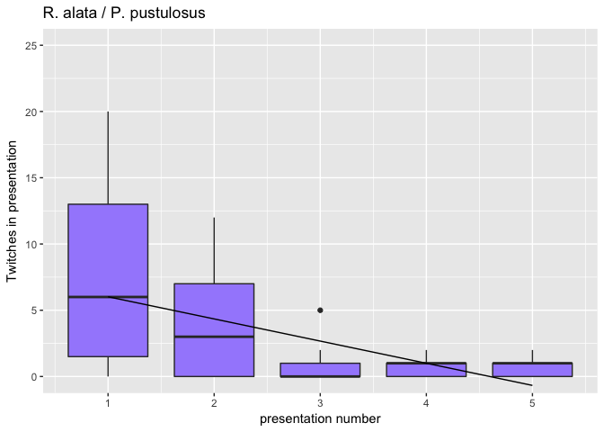<!-- -->

```r
        #t_ra
        t_ra_data <- attn_whole_set_1to5[attn_whole_set_1to5$trial_name_2=="t_ra_t", ]
        p_t_ra <-ggplot(data=t_ra_data, aes(x = set_num, y = all_tw_set))      
        p_t_ra <- p_t_ra + geom_boxplot(aes(fill=factor(set_num)))
        p_t_ra <- p_t_ra + guides(fill=FALSE)
        p_t_ra <- p_t_ra + scale_x_continuous(breaks = c(1,2,3,4,5,6,7)) +
              scale_fill_manual(breaks = c("1", "2", "3", "4", "5", "6", "7"),
                                values=c(  "#C39921", "#C39921", "#C39921", "#C39921", "#C39921","#A58DFC","#C39921" ))
        p_t_ra <- p_t_ra + ylab("Twitches in presentation")
        p_t_ra + xlab("presentation number")
```

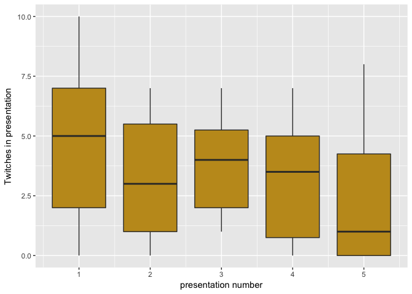<!-- -->

```r
        p_t_ra <- p_t_ra + xlab("presentation number")
        p_t_ra<- p_t_ra + labs(title="P. pustulosus / R. alata")
        p_t_ra<- p_t_ra + coord_cartesian(ylim = c(0, 25)) #sets y limit
        p_t_ra <- p_t_ra + stat_smooth(colour="black", size=0.5, method="lm", se=FALSE ,  data= subset(t_ra_data, t_ra_data$set_num!="6" & t_ra_data$set_num!="7")) 
        p_t_ra
```

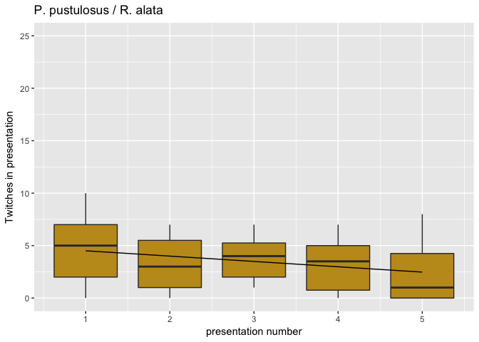<!-- -->

```r
        #rt
        rt_data<- attn_whole_set_1to5[attn_whole_set_1to5$trial_name_2=="t_ra_t", ]
        p_rt <-ggplot(data=rt_data, aes(x = set_num, y = all_tw_set))      
        p_rt <- p_rt + geom_boxplot(aes(fill=factor(set_num)))
        p_rt <- p_rt + guides(fill=FALSE)
        p_rt <- p_rt + scale_x_continuous(breaks = c(1,2,3,4,5,6,7)) +
              scale_fill_manual(breaks = c("1", "2", "3", "4", "5", "6", "7"),
                                values=c( "#1EBF95","#1EBF95", "#1EBF95", "#1EBF95", "#1EBF95","#1EB7E9", "#1EBF95" ))
        p_rt <- p_rt + ylab("Twitches in presentation")
        p_rt + xlab("presentation number")
```

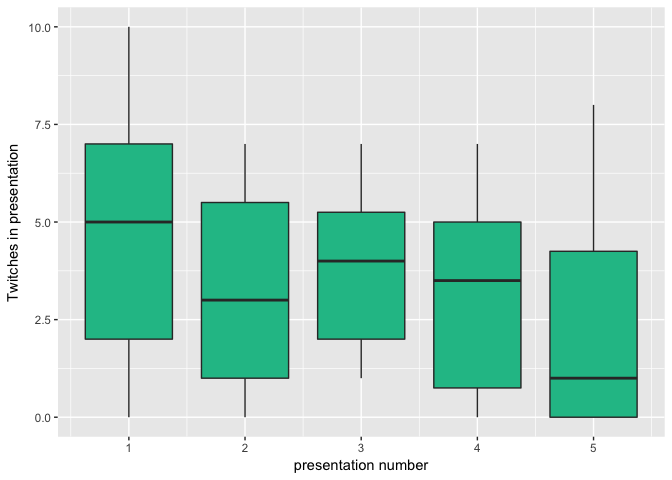<!-- -->

```r
        p_rt <- p_rt + xlab("presentation number")
        p_rt<- p_rt + labs(title="Reversed P. pustulosus / Reversed R. alata")
        p_rt<- p_rt + coord_cartesian(ylim = c(0, 25)) #sets y limit
        p_rt <- p_rt + stat_smooth(colour="black", size=0.5, method="lm", se=FALSE ,  data= subset(rt_data, rt_data$set_num!="6" & rt_data$set_num!="7")) 
        p_rt
```

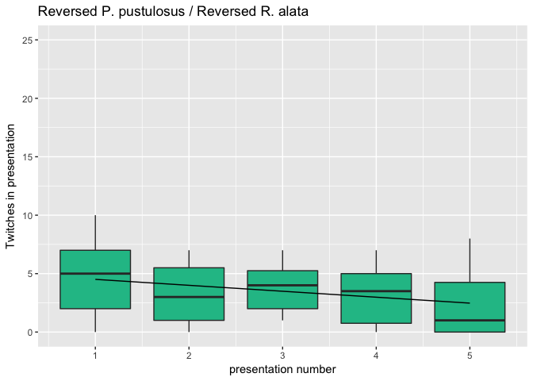<!-- -->

```r
        #tc
        tc_data<- attn_whole_set_1to5[attn_whole_set_1to5$trial_name_2=="tc_ts_tc", ]
        p_tc <-ggplot(data=tc_data, aes(x = set_num, y = all_tw_set))      
        p_tc <- p_tc + geom_boxplot(aes(fill=factor(set_num)))
        p_tc <- p_tc + guides(fill=FALSE)
        p_tc <- p_tc + scale_x_continuous(breaks = c(1,2,3,4,5,6,7)) +
              scale_fill_manual(breaks = c("1", "2", "3", "4", "5", "6", "7"),
                                values=c( "#57B21F", "#57B21F","#57B21F","#57B21F","#57B21F", "#F67770", "#57B21F" ))
        p_tc <- p_tc + ylab("Twitches in presentation")
        p_tc + xlab("presentation number")
```

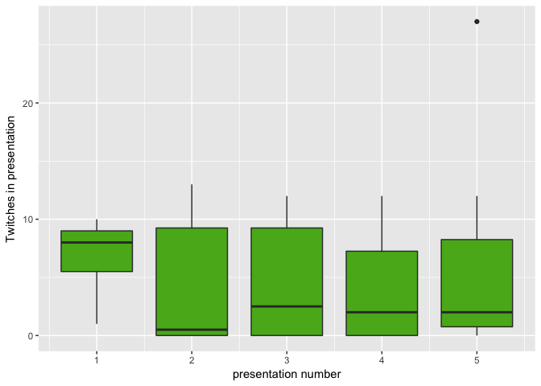<!-- -->

```r
        p_tc <- p_tc + xlab("presentation number")
        p_tc<- p_tc + labs(title="3 chuck P. pustulosus / simple P. pustulosus")
        p_tc<- p_tc + coord_cartesian(ylim = c(0, 25)) #sets y limit
        p_tc <- p_tc + stat_smooth(colour="black", size=0.5, method="lm", se=FALSE ,  data= subset(tc_data, tc_data$set_num!="6" & tc_data$set_num!="7")) 
        p_tc
```

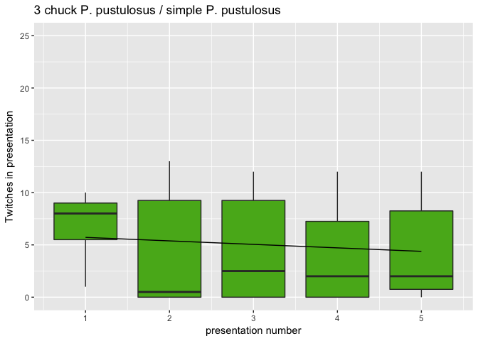<!-- -->

```r
        #ts
        ts_data<- attn_whole_set_1to5[attn_whole_set_1to5$trial_name_2=="ts_tc_ts", ]
        p_ts <-ggplot(data=ts_data, aes(x = set_num, y = all_tw_set))      
        p_ts <- p_ts + geom_boxplot(aes(fill=factor(set_num)))
        p_ts <- p_ts + guides(fill=FALSE)
        p_ts <- p_ts + scale_x_continuous(breaks = c(1,2,3,4,5,6,7)) +
              scale_fill_manual(breaks = c("1", "2", "3", "4", "5", "6", "7"),
                                values=c("#F67770", "#F67770", "#F67770", "#F67770", "#F67770",  "#57B21F", "#F67770" ))
        p_ts <- p_ts + ylab("Twitches in presentation")
        p_ts + xlab("presentation number")
```

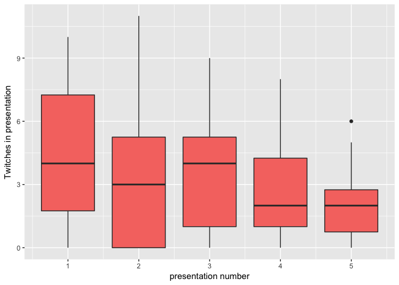<!-- -->

```r
        p_ts <- p_ts + xlab("presentation number")
        p_ts<- p_ts + labs(title="Simple P. pustulosus / 3 chuck P. pustulosus")
        p_ts<- p_ts + coord_cartesian(ylim = c(0, 25)) #sets y limit
        p_ts <- p_ts + stat_smooth(colour="black", size=0.5, method="lm", se=FALSE ,  data= subset(ts_data, ts_data$set_num!="6" & ts_data$set_num!="7")) 
        p_ts
```

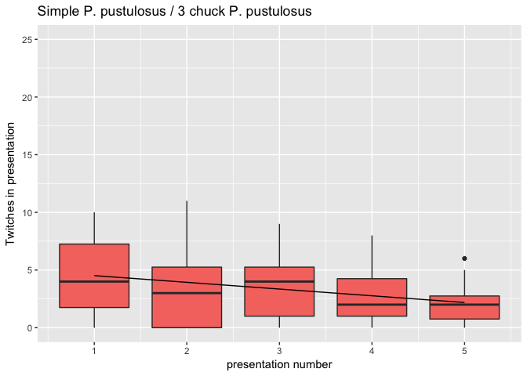<!-- -->

```r
        #tia_tib_tia
        tia_data <- attn_whole_set_1to5[attn_whole_set_1to5$trial_name_2=="tia_tib_tia", ]
        p_tia <-ggplot(data=tia_data, aes(x = set_num, y = all_tw_set))      
        p_tia <- p_tia + geom_boxplot(aes(fill=factor(set_num)))
        p_tia <- p_tia + guides(fill=FALSE)
        p_tia <- p_tia + scale_x_continuous(breaks = c(1,2,3,4,5,6,7)) +
              scale_fill_manual(breaks = c("1", "2", "3", "4", "5", "6", "7"),
                                values=c("#AD881D", "#AD881D","#AD881D","#AD881D","#AD881D", "#DEB339", "#AD881D" )) #using 2 tints of the standard yellow
        p_tia <- p_tia + ylab("Twitches in presentation")
        p_tia + xlab("presentation number")
```

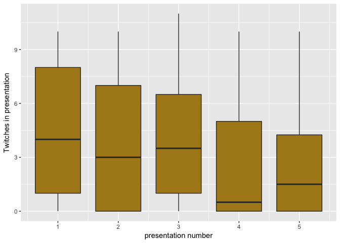<!-- -->

```r
        p_tia <- p_tia + xlab("presentation number")
        p_tia<- p_tia + labs(title="Tungara individuals contrast")
        p_tia<- p_tia + coord_cartesian(ylim = c(0, 25)) #sets y limit
        p_tia <- p_tia + stat_smooth(colour="black", size=0.5, method="lm", se=FALSE ,  data= subset(tia_data, tia_data$set_num!="6" & tia_data$set_num!="7"))
        p_tia
```

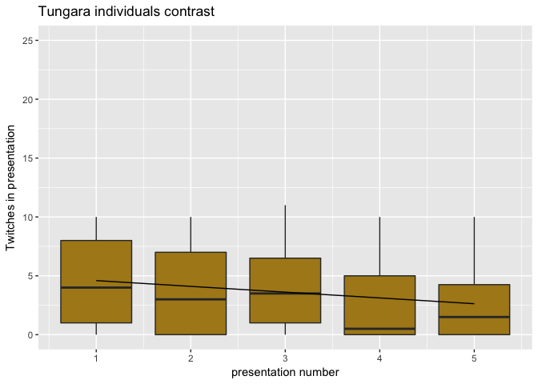<!-- -->

```r
        # Multiple plot function
#
# ggplot objects can be passed in ..., or to plotlist (as a list of ggplot objects)
# - cols:   Number of columns in layout
# - layout: A matrix specifying the layout. If present, 'cols' is ignored.
#
# If the layout is something like matrix(c(1,2,3,3), nrow=2, byrow=TRUE),
# then plot 1 will go in the upper left, 2 will go in the upper right, and
# 3 will go all the way across the bottom.
#
multiplot <- function(..., plotlist=NULL, file, cols=1, layout=NULL) {
  require(grid)

  # Make a list from the ... arguments and plotlist
  plots <- c(list(...), plotlist)

  numPlots = length(plots)

  # If layout is NULL, then use 'cols' to determine layout
  if (is.null(layout)) {
    # Make the panel
    # ncol: Number of columns of plots
    # nrow: Number of rows needed, calculated from # of cols
    layout <- matrix(seq(1, cols * ceiling(numPlots/cols)),
                    ncol = cols, nrow = ceiling(numPlots/cols))
  }

 if (numPlots==1) {
    print(plots[[1]])

  } else {
    # Set up the page
    grid.newpage()
    pushViewport(viewport(layout = grid.layout(nrow(layout), ncol(layout))))

    # Make each plot, in the correct location
    for (i in 1:numPlots) {
      # Get the i,j matrix positions of the regions that contain this subplot
      matchidx <- as.data.frame(which(layout == i, arr.ind = TRUE))

      print(plots[[i]], vp = viewport(layout.pos.row = matchidx$row,
                                      layout.pos.col = matchidx$col))
    }
  }
}
        multiplot(p_ra, p_t_ra, p_rra, p_rt, p_de, p_t_de, p_ts, p_tc, p_tia )
```

```
## Loading required package: grid
```

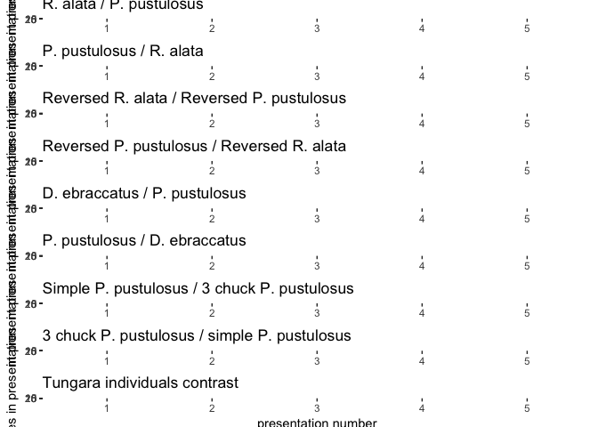<!-- -->


```
## 'data.frame':	2970 obs. of  41 variables:
##  $ Bat_ID         : Factor w/ 11 levels "Bat10","Bat11",..: 1 1 1 1 1 1 1 1 1 1 ...
##  $ bat_name       : Factor w/ 11 levels "Boba_Bat","Captain_Henry_Morgan",..: 6 6 6 6 6 6 6 6 6 6 ...
##  $ video_ID       : Factor w/ 110 levels "M2U02180","M2U02181",..: 22 22 22 22 22 22 22 22 22 22 ...
##  $ trial_name     : Factor w/ 18 levels "de_t_de","ra_t_ra",..: 4 4 4 4 4 4 4 4 4 4 ...
##  $ trial_name_2   : Factor w/ 9 levels "de_t_de","ra_t_ra",..: 4 4 4 4 4 4 4 4 4 4 ...
##  $ primary_stim   : Factor w/ 7 levels "de","ra","rra",..: 4 4 4 4 4 4 4 4 4 4 ...
##  $ first_stim     : Factor w/ 7 levels "de","ra","rra",..: 4 4 4 4 4 4 4 4 4 4 ...
##  $ trial_number   : int  1 1 1 1 1 1 1 1 1 1 ...
##  $ sm_tw_trial    : int  9 9 9 9 9 9 9 9 9 9 ...
##  $ md_tw_trial    : int  7 7 7 7 7 7 7 7 7 7 ...
##  $ lg_tw_trial    : int  0 0 0 0 0 0 0 0 0 0 ...
##  $ Orienting_trial: int  0 0 0 0 0 0 0 0 0 0 ...
##  $ Flying_trial   : int  0 0 0 0 0 0 0 0 0 0 ...
##  $ Approach_trial : int  0 0 0 0 0 0 0 0 0 0 ...
##  $ Grooming_trial : int  0 0 0 0 0 0 0 0 0 0 ...
##  $ Landing_trial  : int  0 0 0 0 0 0 0 0 0 0 ...
##  $ Yawning_trial  : int  0 0 0 0 0 0 0 0 0 0 ...
##  $ set_num        : int  1 1 1 1 1 2 2 2 2 2 ...
##  $ sm_tw_set      : int  3 3 3 3 3 0 0 0 0 0 ...
##  $ md_tw__set     : int  0 0 0 0 0 0 0 0 0 0 ...
##  $ lg_tw_set      : int  0 0 0 0 0 0 0 0 0 0 ...
##  $ mdlg_tw_set    : int  0 0 0 0 0 0 0 0 0 0 ...
##  $ all_tw_set     : int  3 3 3 3 3 0 0 0 0 0 ...
##  $ Orienting_set  : int  0 0 0 0 0 0 0 0 0 0 ...
##  $ Flying_set     : int  0 0 0 0 0 0 0 0 0 0 ...
##  $ Approach_set   : int  0 0 0 0 0 0 0 0 0 0 ...
##  $ Grooming_set   : int  0 0 0 0 0 0 0 0 0 0 ...
##  $ Landing_set    : int  0 0 0 0 0 0 0 0 0 0 ...
##  $ Yawning_set    : int  0 0 0 0 0 0 0 0 0 0 ...
##  $ call_num       : num  1.1 1.2 1.3 1.4 1.5 2.1 2.2 2.3 2.4 2.5 ...
##  $ Flying_call    : int  0 0 0 0 0 0 0 0 0 0 ...
##  $ Grooming_call  : int  0 0 0 0 0 0 0 0 0 0 ...
##  $ sm_tw_call     : int  1 1 1 0 0 0 0 0 0 0 ...
##  $ md_tw_call     : int  0 0 0 0 0 0 0 0 0 0 ...
##  $ lg_tw_call     : int  0 0 0 0 0 0 0 0 0 0 ...
##  $ mdlg_tw_call   : int  0 0 0 0 0 0 0 0 0 0 ...
##  $ all_tw_call    : int  1 1 1 0 0 0 0 0 0 0 ...
##  $ Orienting_call : int  0 0 0 0 0 0 0 0 0 0 ...
##  $ Approach_call  : int  0 0 0 0 0 0 0 0 0 0 ...
##  $ Landing_call   : int  0 0 0 0 0 0 0 0 0 0 ...
##  $ Yawning_call   : int  0 0 0 0 0 0 0 0 0 0 ...
```

  
   
   
# Discrimination

The following are all the tests for discimination. In each of the following trials, we are comparing the response to the 5th set to the 6th set (the discrimination stimulus), and the 7th set (the dishabituation simulus). A significantly greater response to the 6th or 7th set from the 5th set is indicative of discrimination between the stimuli. In all cases the response was the total number of ear twitches. 
     
To analyze these, I used linear mixed models with the following model: 
     
       *total twitches ~ set number , random = bat*

      (I used trial_number in other models in this analysis, but it did not explain more of the variance in this case)
      


##quickie summary chart version: 

| trial_name | descrim? |dishabit? | comments
|:----------|------|------|-------------------------------------------|
|de_t_de  | no | no | probably bc no habituation in first place |
|t_de_t | no |no | probably bc high overall responses, low habit |
|ra_t_ta |yes, strong | yes | model failed to converge tho |
|t_ra_t | no | no | model didn't converge, failed hessian? |
|rra_rt_rra | yes, strong | no |  |
|rt_rra_rt | yes | no |  |
|tc_ts_tc |no |no |  crazy outlier to deal with, nothing either way, possibly no habituation|
|ts_tc_ts | yes | no | more clear bc better habituation|
| tia_tib_tia | no | no | not even at all. should have habituated too |

##Discrimination stats      
      

 


### *D. ebracattus* v Tungara: 
normality of data:
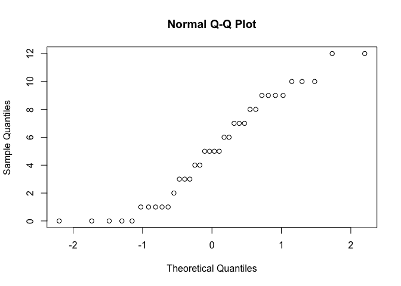<!-- -->


Results of linear mixed model: This models asks whether there is a significant difference between set 5 & 6, and 5 & 7. 


```r
#summary(de_desc)
summary(de_desc_glm)
```

```
## Generalized linear mixed model fit by maximum likelihood (Laplace
##   Approximation) [glmerMod]
##  Family: poisson  ( log )
## Formula: all_tw_set ~ as.factor(set_num) + (1 | Bat_ID)
##    Data: subset_de1
## 
##      AIC      BIC   logLik deviance df.resid 
##    185.6    191.9    -88.8    177.6       32 
## 
## Scaled residuals: 
##     Min      1Q  Median      3Q     Max 
## -1.7559 -0.7837 -0.0929  0.4878  2.1284 
## 
## Random effects:
##  Groups Name        Variance Std.Dev.
##  Bat_ID (Intercept) 0.9339   0.9664  
## Number of obs: 36, groups:  Bat_ID, 12
## 
## Fixed effects:
##                     Estimate Std. Error z value Pr(>|z|)    
## (Intercept)          1.29944    0.31951   4.067 4.76e-05 ***
## as.factor(set_num)6  0.06351    0.17598   0.361    0.718    
## as.factor(set_num)7 -0.06782    0.18186  -0.373    0.709    
## ---
## Signif. codes:  0 '***' 0.001 '**' 0.01 '*' 0.05 '.' 0.1 ' ' 1
## 
## Correlation of Fixed Effects:
##             (Intr) a.(_)6
## as.fctr(_)6 -0.284       
## as.fctr(_)7 -0.275  0.499
```

```r
de_t_de_desc <- boxplot(all_tw_set ~ (as.factor(set_num)), main = "de_t_de", data=subset_de1)
```

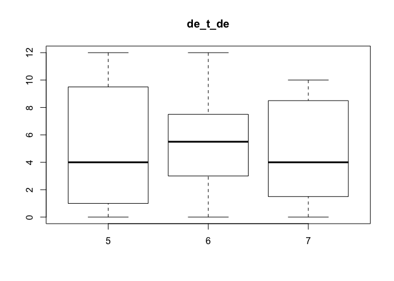<!-- -->


So, there is no evidence of discrimination between ebracattus and tungara. This may be because there was no habituation to D. ebracattus (actually there was slight sensitization)       


### *Rhinella alata* v Tungara
normality of data: 

```r
qqnorm(subset_ra1$all_tw_set)
```

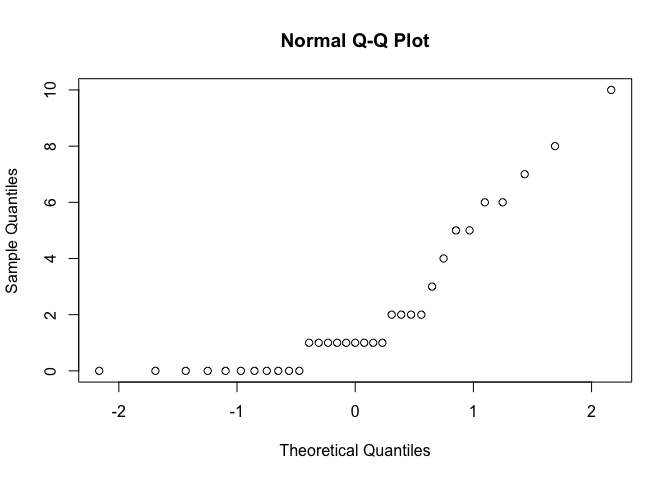<!-- -->


```r
summary(ra_desc_glm)
```

```
## Generalized linear mixed model fit by maximum likelihood (Laplace
##   Approximation) [glmerMod]
##  Family: poisson  ( log )
## Formula: all_tw_set ~ as.factor(set_num) + (1 | Bat_ID)
##    Data: subset_ra1
## 
##      AIC      BIC   logLik deviance df.resid 
##    122.8    128.8    -57.4    114.8       29 
## 
## Scaled residuals: 
##     Min      1Q  Median      3Q     Max 
## -1.4360 -0.6993 -0.3542  0.6007  2.3886 
## 
## Random effects:
##  Groups Name        Variance Std.Dev.
##  Bat_ID (Intercept) 0.4609   0.6789  
## Number of obs: 33, groups:  Bat_ID, 11
## 
## Fixed effects:
##                      Estimate Std. Error z value Pr(>|z|)    
## (Intercept)         -0.670687   0.003830  -175.1   <2e-16 ***
## as.factor(set_num)6  1.908520   0.003829   498.5   <2e-16 ***
## as.factor(set_num)7  0.894325   0.003826   233.7   <2e-16 ***
## ---
## Signif. codes:  0 '***' 0.001 '**' 0.01 '*' 0.05 '.' 0.1 ' ' 1
## 
## Correlation of Fixed Effects:
##             (Intr) a.(_)6
## as.fctr(_)6 0.001        
## as.fctr(_)7 0.000  0.000 
## convergence code: 0
## Model failed to converge with max|grad| = 0.0185552 (tol = 0.001, component 1)
```

```r
#boxplot
ra_descrim_plot<- boxplot(all_tw_set ~ (as.factor(set_num)), main = "ra_t_ra", data=subset_ra1)
```

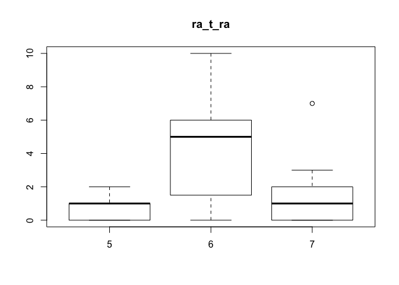<!-- -->

There is evidence for descrimination between rhinella alata and tungara frogs

### Reversed *R. alata* v tungara

Normality of data:

```r
qqnorm(subset_rra1$all_tw_set)
```

<!-- -->


```r
#summary(rra_desc)
summary(rra_desc_glm)
```

```
## Generalized linear mixed model fit by maximum likelihood (Laplace
##   Approximation) [glmerMod]
##  Family: poisson  ( log )
## Formula: all_tw_set ~ as.factor(set_num) + (1 | Bat_ID)
##    Data: subset_rra1
## 
##      AIC      BIC   logLik deviance df.resid 
##    113.8    119.8    -52.9    105.8       29 
## 
## Scaled residuals: 
##     Min      1Q  Median      3Q     Max 
## -1.6110 -0.7629 -0.1414  0.5437  1.5878 
## 
## Random effects:
##  Groups Name        Variance Std.Dev.
##  Bat_ID (Intercept) 0.305    0.5523  
## Number of obs: 33, groups:  Bat_ID, 11
## 
## Fixed effects:
##                     Estimate Std. Error z value Pr(>|z|)    
## (Intercept)          -0.5961     0.4153  -1.435    0.151    
## as.factor(set_num)6   2.0053     0.3963   5.060 4.19e-07 ***
## as.factor(set_num)7   0.4520     0.4759   0.950    0.342    
## ---
## Signif. codes:  0 '***' 0.001 '**' 0.01 '*' 0.05 '.' 0.1 ' ' 1
## 
## Correlation of Fixed Effects:
##             (Intr) a.(_)6
## as.fctr(_)6 -0.841       
## as.fctr(_)7 -0.700  0.734
```

```r
#boxplot
boxplot(all_tw_set ~ (as.factor(set_num)), main = "rra_rt_rra", data=subset_rra1)
```

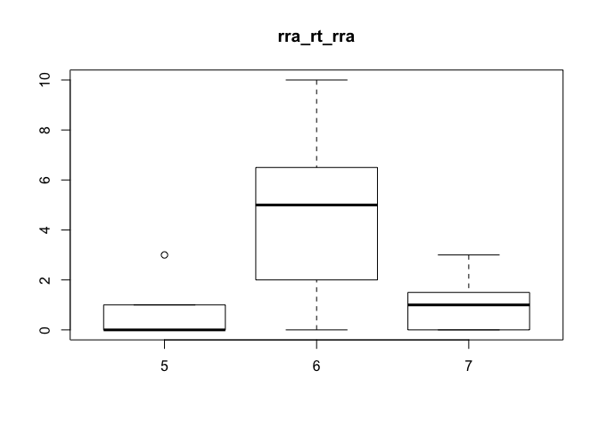<!-- -->

There is evidence for descrimination between 5 and 6, but not for dishabituation (5 and 7). There was very steep habituation to reversed rhinella alata, which might explain a part of this trend. 

So, clearly they discriminate / can discriminate to the sounds of the reversed rhinella and the reversed tungara. 


### reversed tungara v reversed *R. alata*

Normality of data: 
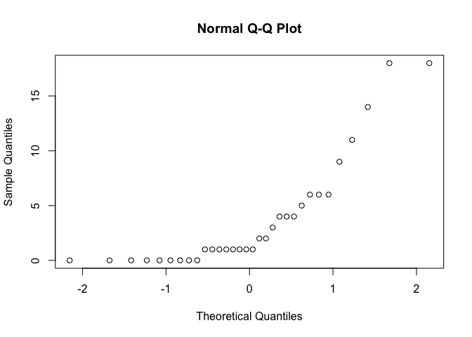<!-- -->

This linear mixed model may not be appropriate for this test given its right-skewed distribution


```r
summary(rt_desc_glm)
```

```
## Generalized linear mixed model fit by maximum likelihood (Laplace
##   Approximation) [glmerMod]
##  Family: poisson  ( log )
## Formula: all_tw_set ~ as.factor(set_num) + (1 | Bat_ID)
##    Data: subset_rt1
## 
##      AIC      BIC   logLik deviance df.resid 
##    201.1    207.0    -96.5    193.1       28 
## 
## Scaled residuals: 
##     Min      1Q  Median      3Q     Max 
## -2.3675 -0.9938 -0.4938  1.0661  3.7317 
## 
## Random effects:
##  Groups Name        Variance Std.Dev.
##  Bat_ID (Intercept) 0.5036   0.7097  
## Number of obs: 32, groups:  Bat_ID, 11
## 
## Fixed effects:
##                     Estimate Std. Error z value Pr(>|z|)    
## (Intercept)           0.5280     0.3131   1.687 0.091663 .  
## as.factor(set_num)6   0.9162     0.2475   3.702 0.000214 ***
## as.factor(set_num)7   0.3686     0.2959   1.246 0.212887    
## ---
## Signif. codes:  0 '***' 0.001 '**' 0.01 '*' 0.05 '.' 0.1 ' ' 1
## 
## Correlation of Fixed Effects:
##             (Intr) a.(_)6
## as.fctr(_)6 -0.589       
## as.fctr(_)7 -0.532  0.627
```

```r
#boxplot
boxplot(all_tw_set ~ (as.factor(set_num)), main = "rt_rra_rt", data=subset_rt1)
```

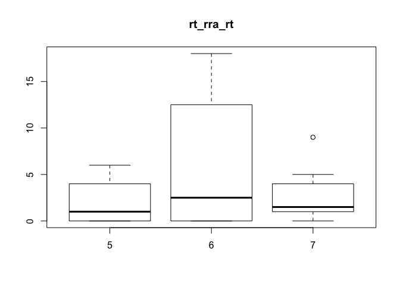<!-- -->

```r
#logged boxplot:

rt_desc_transformed<-boxplot((log(all_tw_set+1)) ~ (as.factor(set_num)), main = "rt_rra_rt log transformed", data=subset_rt1)
```

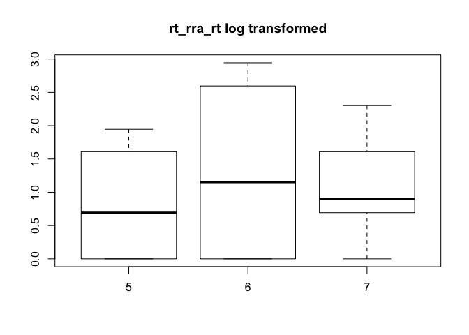<!-- -->


So again, there is discrimination, if not dishabituation between reversed tungara and reversed alata. 


### Tungara v *D. ebracattus*

<!-- -->

```
## Generalized linear mixed model fit by maximum likelihood (Laplace
##   Approximation) [glmerMod]
##  Family: poisson  ( log )
## Formula: all_tw_set ~ as.factor(set_num) + (1 | Bat_ID)
##    Data: subset_t_de1
## 
##      AIC      BIC   logLik deviance df.resid 
##    168.2    174.2    -80.1    160.2       29 
## 
## Scaled residuals: 
##     Min      1Q  Median      3Q     Max 
## -2.3489 -0.7825 -0.2200  0.7723  2.4051 
## 
## Random effects:
##  Groups Name        Variance Std.Dev.
##  Bat_ID (Intercept) 1.037    1.019   
## Number of obs: 33, groups:  Bat_ID, 11
## 
## Fixed effects:
##                     Estimate Std. Error z value Pr(>|z|)   
## (Intercept)           0.9522     0.3644   2.613  0.00897 **
## as.factor(set_num)6   0.1985     0.2072   0.958  0.33813   
## as.factor(set_num)7  -0.2796     0.2340  -1.195  0.23226   
## ---
## Signif. codes:  0 '***' 0.001 '**' 0.01 '*' 0.05 '.' 0.1 ' ' 1
## 
## Correlation of Fixed Effects:
##             (Intr) a.(_)6
## as.fctr(_)6 -0.312       
## as.fctr(_)7 -0.277  0.486
```

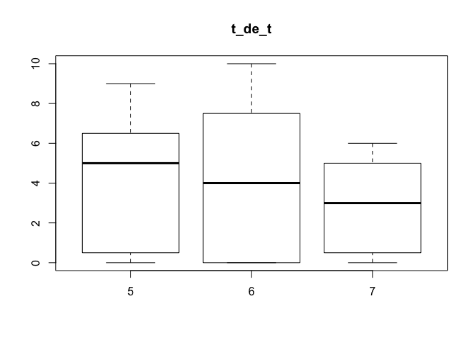<!-- -->

There is no evidence for descrimination between tungara and dendrobates Perhaps/ likley due to high overall responses

###Tungara v R. alata
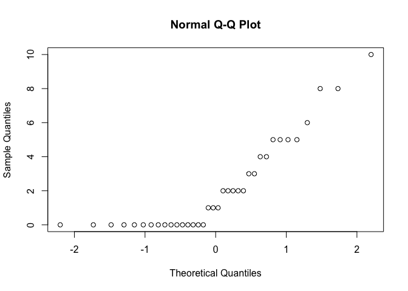<!-- -->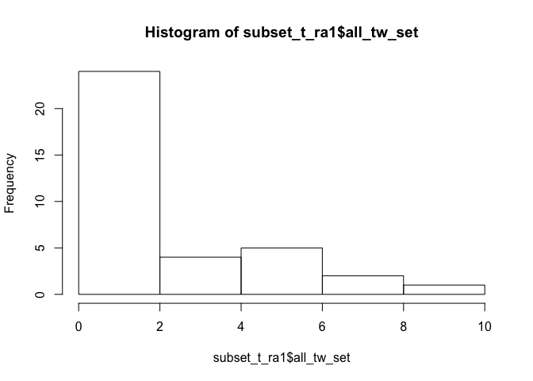<!-- -->

```
## Warning in checkConv(attr(opt, "derivs"), opt$par, ctrl = control
## $checkConv, : unable to evaluate scaled gradient
```

```
## Warning in checkConv(attr(opt, "derivs"), opt$par, ctrl = control
## $checkConv, : Model failed to converge: degenerate Hessian with 1 negative
## eigenvalues
```

```
## Warning in vcov.merMod(object, use.hessian = use.hessian): variance-covariance matrix computed from finite-difference Hessian is
## not positive definite or contains NA values: falling back to var-cov estimated from RX
```

```
## Warning in vcov.merMod(object, correlation = correlation, sigm = sig): variance-covariance matrix computed from finite-difference Hessian is
## not positive definite or contains NA values: falling back to var-cov estimated from RX
```

```
## Generalized linear mixed model fit by maximum likelihood (Laplace
##   Approximation) [glmerMod]
##  Family: poisson  ( log )
## Formula: all_tw_set ~ as.factor(set_num) + (1 | Bat_ID)
##    Data: subset_t_ra1
## 
##      AIC      BIC   logLik deviance df.resid 
##    154.2    160.6    -73.1    146.2       32 
## 
## Scaled residuals: 
##     Min      1Q  Median      3Q     Max 
## -1.8048 -0.7851 -0.5554  0.5373  3.5929 
## 
## Random effects:
##  Groups Name        Variance Std.Dev.
##  Bat_ID (Intercept) 1.401    1.184   
## Number of obs: 36, groups:  Bat_ID, 12
## 
## Fixed effects:
##                     Estimate Std. Error z value Pr(>|z|)
## (Intercept)          0.30271    0.40873   0.741    0.459
## as.factor(set_num)6 -0.07403    0.27377  -0.270    0.787
## as.factor(set_num)7 -0.11315    0.27659  -0.409    0.682
## 
## Correlation of Fixed Effects:
##             (Intr) a.(_)6
## as.fctr(_)6 -0.323       
## as.fctr(_)7 -0.319  0.477
## convergence code: 0
## unable to evaluate scaled gradient
## Model failed to converge: degenerate  Hessian with 1 negative eigenvalues
```

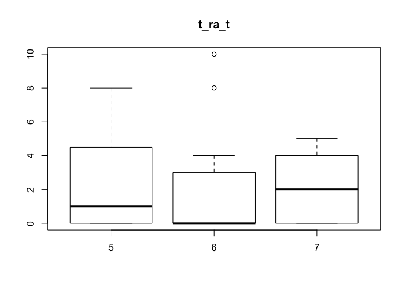<!-- -->
####*** Probably not converging bc the ra is so close to 0 (hessian boundry?)
## return to this to troubleshoot. 

No discimination between treatments detected. 

#### Use relevel to see whether there is a difference between set 6 and 7

```
## Linear mixed-effects model fit by REML
##  Data: subset_t_ra1 
##        AIC      BIC    logLik
##   111.1914 118.6739 -50.59568
## 
## Random effects:
##  Formula: ~1 | Bat_ID
##         (Intercept)  Residual
## StdDev:   0.7091002 0.8239083
## 
## Fixed effects: (sqrt(all_tw_set)) ~ as.factor(set_num) 
##                         Value Std.Error DF   t-value p-value
## (Intercept)         0.9015943 0.3138004 22 2.8731462  0.0088
## as.factor(set_num)5 0.2590889 0.3363592 22 0.7702744  0.4493
## as.factor(set_num)7 0.1818001 0.3363592 22 0.5404939  0.5943
##  Correlation: 
##                     (Intr) a.(_)5
## as.factor(set_num)5 -0.536       
## as.factor(set_num)7 -0.536  0.500
## 
## Standardized Within-Group Residuals:
##        Min         Q1        Med         Q3        Max 
## -1.6787313 -0.5310600 -0.1110658  0.6506607  2.4602037 
## 
## Number of Observations: 36
## Number of Groups: 12
```

. 

## Intraspecific Trials

## Complex tungara v simple tungara

```r
qqnorm(subset_tc1$all_tw_set)
```

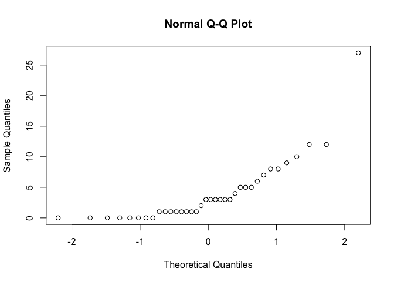<!-- -->

```r
#one total outlier (what should I do about that?)
tc_desc_glm <- glmer(all_tw_set ~ as.factor(set_num) + (1|Bat_ID) , data = subset_tc1, family= "poisson")
summary(tc_desc_glm)
```

```
## Generalized linear mixed model fit by maximum likelihood (Laplace
##   Approximation) [glmerMod]
##  Family: poisson  ( log )
## Formula: all_tw_set ~ as.factor(set_num) + (1 | Bat_ID)
##    Data: subset_tc1
## 
##      AIC      BIC   logLik deviance df.resid 
##    181.7    188.1    -86.9    173.7       32 
## 
## Scaled residuals: 
##     Min      1Q  Median      3Q     Max 
## -2.2714 -0.7055 -0.0501  0.5760  3.3764 
## 
## Random effects:
##  Groups Name        Variance Std.Dev.
##  Bat_ID (Intercept) 1.595    1.263   
## Number of obs: 36, groups:  Bat_ID, 12
## 
## Fixed effects:
##                     Estimate Std. Error z value Pr(>|z|)    
## (Intercept)           1.0849     0.4076   2.662 0.007771 ** 
## as.factor(set_num)6  -0.7087     0.2125  -3.334 0.000856 ***
## as.factor(set_num)7  -0.2826     0.1862  -1.517 0.129149    
## ---
## Signif. codes:  0 '***' 0.001 '**' 0.01 '*' 0.05 '.' 0.1 ' ' 1
## 
## Correlation of Fixed Effects:
##             (Intr) a.(_)6
## as.fctr(_)6 -0.172       
## as.fctr(_)7 -0.196  0.377
```

```r
# boxplot
tc_ts_tc_plot<- boxplot(all_tw_set ~ (as.factor(set_num)), main = "tc_ts_tc", data=subset_tc1)
```

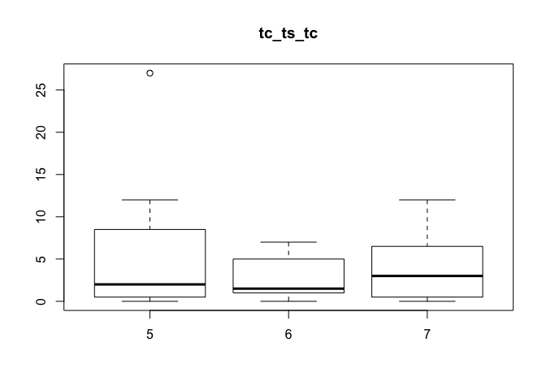<!-- -->

```r
#dealing with outlier
#View(subset_tc1)
subset_tc1$all_tw_set.no<-subset_tc1$all_tw_set
subset_tc1$all_tw_set.no <- ifelse(subset_tc1$all_tw_set.no > 15, NA, subset_tc1$all_tw_set.no) #removing points over 15
tc_ts_tc_plot.no<- boxplot(all_tw_set.no ~ (as.factor(set_num)), main = "tc_ts_tc", data=subset_tc1)
```

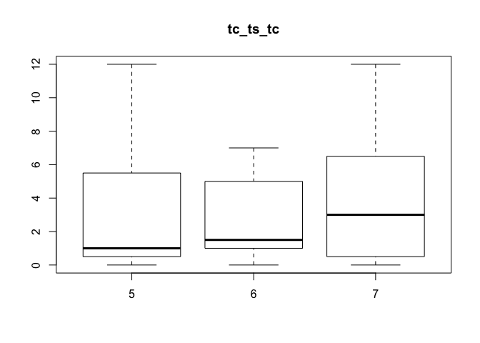<!-- -->

```r
tc_desc_glm.no <- glmer(all_tw_set.no ~ as.factor(set_num) + (1|Bat_ID) , data = subset_tc1, family= "poisson")
summary(tc_desc_glm.no)
```

```
## Generalized linear mixed model fit by maximum likelihood (Laplace
##   Approximation) [glmerMod]
##  Family: poisson  ( log )
## Formula: all_tw_set.no ~ as.factor(set_num) + (1 | Bat_ID)
##    Data: subset_tc1
## 
##      AIC      BIC   logLik deviance df.resid 
##    148.2    154.4    -70.1    140.2       31 
## 
## Scaled residuals: 
##     Min      1Q  Median      3Q     Max 
## -1.3100 -0.6434 -0.1235  0.3458  1.7932 
## 
## Random effects:
##  Groups Name        Variance Std.Dev.
##  Bat_ID (Intercept) 1.289    1.135   
## Number of obs: 35, groups:  Bat_ID, 12
## 
## Fixed effects:
##                     Estimate Std. Error z value Pr(>|z|)  
## (Intercept)           0.7078     0.3880   1.824   0.0681 .
## as.factor(set_num)6  -0.2459     0.2374  -1.036   0.3003  
## as.factor(set_num)7   0.1802     0.2142   0.841   0.4002  
## ---
## Signif. codes:  0 '***' 0.001 '**' 0.01 '*' 0.05 '.' 0.1 ' ' 1
## 
## Correlation of Fixed Effects:
##             (Intr) a.(_)6
## as.fctr(_)6 -0.286       
## as.fctr(_)7 -0.317  0.516
```

```r
#makes nothing significant at all. Diff between last 2? 
```


There is no apparent discrimination between complex and simple calls in this test. However, there is an outlier that could easily be messing with this. Outlier doesn't change the relationship. It just makes them all the more the same

If this is accurate, it is probable that discrimination is obscured by simple calls being less salient stimuli, so the interuption in habituation is masked by lower overall interest in the simple call. See the inverse treatment:

##Simple tungara against complex tungara call

```r
qqnorm(subset_ts1$all_tw_set)
```

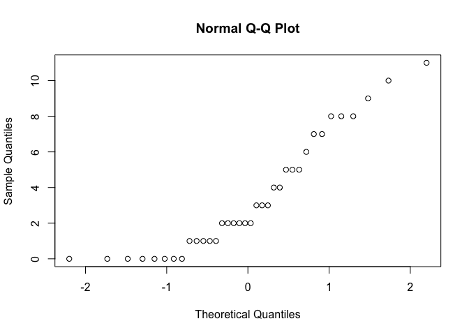<!-- -->

```r
hist(subset_ts1$all_tw_set)
```

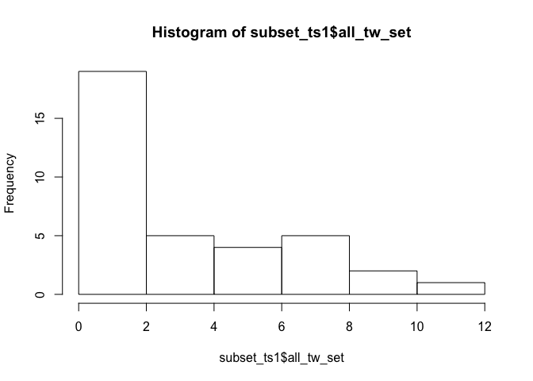<!-- -->

```r
#looks oookay (pretty 0 weighted)
ts_desc_glm <- glmer(all_tw_set ~ as.factor(set_num) + (1|Bat_ID) , data = subset_ts1, family= "poisson")
#ts_desc<- lme(all_tw_set ~ as.factor(set_num), random = ~1|Bat_ID, data = subset_ts1) # use as.factor so  sees these as factors
summary(ts_desc_glm)
```

```
## Generalized linear mixed model fit by maximum likelihood (Laplace
##   Approximation) [glmerMod]
##  Family: poisson  ( log )
## Formula: all_tw_set ~ as.factor(set_num) + (1 | Bat_ID)
##    Data: subset_ts1
## 
##      AIC      BIC   logLik deviance df.resid 
##    164.5    170.9    -78.3    156.5       32 
## 
## Scaled residuals: 
##     Min      1Q  Median      3Q     Max 
## -1.4142 -0.7839 -0.2993  0.6522  2.3175 
## 
## Random effects:
##  Groups Name        Variance Std.Dev.
##  Bat_ID (Intercept) 0.5967   0.7725  
## Number of obs: 36, groups:  Bat_ID, 12
## 
## Fixed effects:
##                     Estimate Std. Error z value Pr(>|z|)    
## (Intercept)           0.5145     0.3058   1.682 0.092489 .  
## as.factor(set_num)6   0.8850     0.2294   3.858 0.000114 ***
## as.factor(set_num)7   0.2683     0.2564   1.046 0.295365    
## ---
## Signif. codes:  0 '***' 0.001 '**' 0.01 '*' 0.05 '.' 0.1 ' ' 1
## 
## Correlation of Fixed Effects:
##             (Intr) a.(_)6
## as.fctr(_)6 -0.531       
## as.fctr(_)7 -0.475  0.633
```

```r
# boxplot
ts_tc_ts_plot<- boxplot(all_tw_set ~ (as.factor(set_num)), main = "ts_tc_ts", data=subset_ts1)    
```

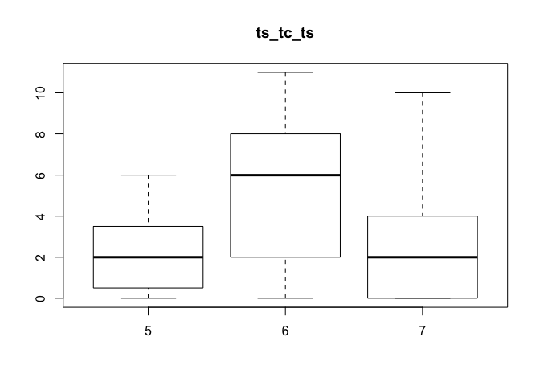<!-- -->

This shows that bats discriminate between complex and simple tungara calls (0c v 2c). There is clear evidence of discrimination, but not of dishabituation  Note how discrimination is more apparent when the less salient stimulus is the one that is being habituated. ((Also, more habituation=more evidence of discrimination))

## Tungara "A" v Tungara "B" (or the id of individuals trials)


```r
qqnorm(subset_tia1$all_tw_set)
```

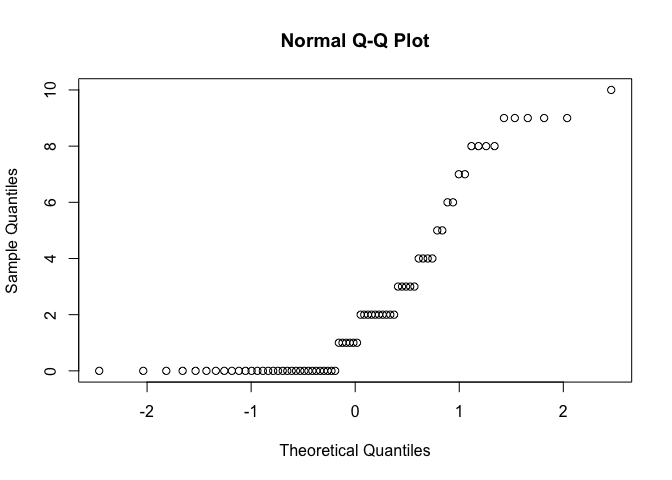<!-- -->

```r
# not justifiably normal (left/0 skewed)
#tia_desc<- lme(all_tw_set ~ as.factor(set_num), random = ~1|Bat_ID, data = subset_tia1) # use as.factor so  sees these as factors
tia_desc_glm <- glmer(all_tw_set ~ as.factor(set_num) + (1|Bat_ID) , data = subset_tia1, family= "poisson")
summary(tia_desc_glm)
```

```
## Generalized linear mixed model fit by maximum likelihood (Laplace
##   Approximation) [glmerMod]
##  Family: poisson  ( log )
## Formula: all_tw_set ~ as.factor(set_num) + (1 | Bat_ID)
##    Data: subset_tia1
## 
##      AIC      BIC   logLik deviance df.resid 
##    278.3    287.4   -135.1    270.3       68 
## 
## Scaled residuals: 
##     Min      1Q  Median      3Q     Max 
## -1.7873 -0.9033 -0.5710  0.9016  3.6872 
## 
## Random effects:
##  Groups Name        Variance Std.Dev.
##  Bat_ID (Intercept) 1.373    1.172   
## Number of obs: 72, groups:  Bat_ID, 12
## 
## Fixed effects:
##                     Estimate Std. Error z value Pr(>|z|)  
## (Intercept)          0.41581    0.37456   1.110   0.2669  
## as.factor(set_num)6  0.01504    0.17116   0.088   0.9300  
## as.factor(set_num)7 -0.33951    0.18836  -1.802   0.0715 .
## ---
## Signif. codes:  0 '***' 0.001 '**' 0.01 '*' 0.05 '.' 0.1 ' ' 1
## 
## Correlation of Fixed Effects:
##             (Intr) a.(_)6
## as.fctr(_)6 -0.230       
## as.fctr(_)7 -0.209  0.458
```

```r
# boxplot
tia_tib_tia_plot<- boxplot(all_tw_set ~ (as.factor(set_num)), main = "tia_tib_tia", data=subset_tia1)
```

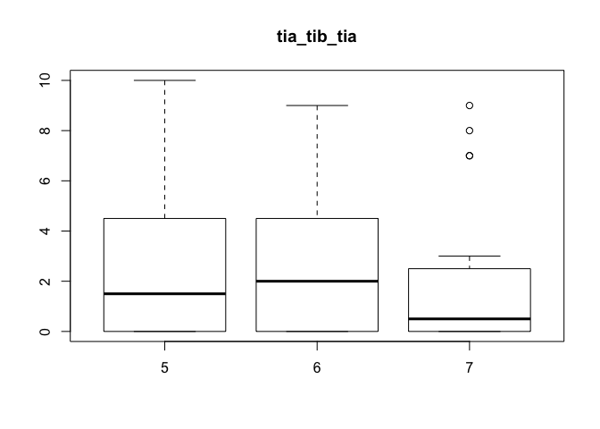<!-- -->

There is no apparent discrimination between individual tungaras. 

## Summary chart


| trial_name | descrim? |dishabit? | comments
|:----------|------|------|-------------------------------------------|
|de_t_de  | no | no | probably bc no habituation in first place |
|t_de_t | no |no | probably bc high overall responses, low habit |
|ra_t_ta |yes, strong | yes | model failed to converge tho |
|t_ra_t | no | no | model didn't converge, failed hessian? |
|rra_rt_rra | yes, strong | no |  |
|rt_rra_rt | yes | no |  |
|tc_ts_tc |no |no |  crazy outlier to deal with, possbily no habituation|
|ts_tc_ts | yes | no | more clear bc better habituation|
| tia_tib_tia | no | no | not even at all. should have habituated too |


###Verbal explanation of discrimination results

Habituated fastest to Rhinella, followed by the reversed rhinella, followed by all the simple and one chuck tungaras, followed by the dendropsophes and the complex tungara, which they habituated to least. 
Consistent with expectations. 
	- Habituated faster to less biologically relevent simuli
	- But could it be that they didn't habituate to dendropsophes bc initial interest was so low, and there wasn't much of a place to habituate to? Depends on initial interest to TC, with second highest slope. If ithe initial interest is higher, and they still didn't habituate, more suggestive of higher interest indicated by low habituation rates. Redo initial interest to check. 
	- Could also be that the groups that showed lower habituation rates only did so bc they had less initial interest, and there was a floor effect-- less downward interest space in which to move.
 Is there a difference between the interest scores during test 5? Or are they all basically 0:

##Investigating response to 5th set
 

```r
#investigating difs in response to 5th stimulus
# running glmer 
# using relevel to find the true value (intercept) for each variable, and what is significantly different from each variable. 
 attn_set_5 <- read.table("/Users/maydixon/Dropbox/Attention Project/R/attn_set5_only.txt", header=TRUE) #local      
      
attn_set_5$primary_stim<-factor(attn_set_5$primary_stim, ordered=FALSE)   #make it a factor so it can be ranked     
attn_set_5$primary_stim <- relevel(attn_set_5$primary_stim,"De") #MAKE DE REFERENCE
        nlme_5set_de_ref<- glmer(all_tw_set ~ primary_stim + (trial_number|Bat_ID), family= "poisson", data = attn_set_5)
        summary(nlme_5set_de_ref)
```

```
## Generalized linear mixed model fit by maximum likelihood (Laplace
##   Approximation) [glmerMod]
##  Family: poisson  ( log )
## Formula: all_tw_set ~ primary_stim + (trial_number | Bat_ID)
##    Data: attn_set_5
## 
##      AIC      BIC   logLik deviance df.resid 
##    367.3    391.4   -173.7    347.3       72 
## 
## Scaled residuals: 
##     Min      1Q  Median      3Q     Max 
## -1.9389 -0.9426 -0.3423  0.4710  3.9070 
## 
## Random effects:
##  Groups Name         Variance Std.Dev. Corr 
##  Bat_ID (Intercept)  1.040    1.0200        
##         trial_number 0.031    0.1761   -0.72
## Number of obs: 82, groups:  Bat_ID, 12
## 
## Fixed effects:
##                 Estimate Std. Error z value Pr(>|z|)    
## (Intercept)       1.4648     0.2740   5.346 9.01e-08 ***
## primary_stimRa   -2.2966     0.3972  -5.782 7.40e-09 ***
## primary_stimRra  -2.2153     0.4244  -5.220 1.79e-07 ***
## primary_stimRt   -0.9625     0.3031  -3.176  0.00149 ** 
## primary_stimT1c  -0.7070     0.2577  -2.744  0.00608 ** 
## primary_stimT2c  -0.1176     0.2377  -0.495  0.62072    
## primary_stimTs   -0.6888     0.2273  -3.031  0.00244 ** 
## ---
## Signif. codes:  0 '***' 0.001 '**' 0.01 '*' 0.05 '.' 0.1 ' ' 1
## 
## Correlation of Fixed Effects:
##             (Intr) primry_stmR prmry_stmRr prmry_stmRt prm_T1 prm_T2
## primry_stmR -0.136                                                  
## prmry_stmRr -0.207  0.078                                           
## prmry_stmRt -0.319  0.111       0.315                               
## prmry_stmT1 -0.366  0.162       0.315       0.453                   
## prmry_stmT2 -0.389  0.171       0.353       0.488       0.643       
## prmry_stmTs -0.338  0.188       0.264       0.366       0.409  0.456
```

```r
        attn_set_5$primary_stim <- relevel(attn_set_5$primary_stim,"Ra") #MAKE RA REFERENCE
        nlme_5set_ra_ref<- glmer(all_tw_set ~ primary_stim + (trial_number|Bat_ID), family= "poisson", data = attn_set_5)
        summary(nlme_5set_ra_ref)
```

```
## Generalized linear mixed model fit by maximum likelihood (Laplace
##   Approximation) [glmerMod]
##  Family: poisson  ( log )
## Formula: all_tw_set ~ primary_stim + (trial_number | Bat_ID)
##    Data: attn_set_5
## 
##      AIC      BIC   logLik deviance df.resid 
##    367.3    391.4   -173.7    347.3       72 
## 
## Scaled residuals: 
##     Min      1Q  Median      3Q     Max 
## -1.9389 -0.9426 -0.3423  0.4710  3.9071 
## 
## Random effects:
##  Groups Name         Variance Std.Dev. Corr 
##  Bat_ID (Intercept)  1.04038  1.020         
##         trial_number 0.03099  0.176    -0.72
## Number of obs: 82, groups:  Bat_ID, 12
## 
## Fixed effects:
##                 Estimate Std. Error z value Pr(>|z|)    
## (Intercept)     -0.83189    0.45088  -1.845 0.065031 .  
## primary_stimDe   2.29666    0.39725   5.781 7.41e-09 ***
## primary_stimRra  0.08129    0.55835   0.146 0.884239    
## primary_stimRt   1.33422    0.47223   2.825 0.004722 ** 
## primary_stimT1c  1.58979    0.43706   3.638 0.000275 ***
## primary_stimT2c  2.17911    0.42657   5.108 3.25e-07 ***
## primary_stimTs   1.60794    0.41897   3.838 0.000124 ***
## ---
## Signif. codes:  0 '***' 0.001 '**' 0.01 '*' 0.05 '.' 0.1 ' ' 1
## 
## Correlation of Fixed Effects:
##             (Intr) prmr_D prmry_stmRr prmry_stmRt prm_T1 prm_T2
## primry_stmD -0.798                                             
## prmry_stmRr -0.612  0.652                                      
## prmry_stmRt -0.733  0.770  0.652                               
## prmry_stmT1 -0.773  0.813  0.666       0.791                   
## prmry_stmT2 -0.791  0.836  0.689       0.812       0.882       
## prmry_stmTs -0.779  0.846  0.655       0.772       0.809  0.835
```

```r
        attn_set_5$primary_stim <- relevel(attn_set_5$primary_stim,"Rra") #MAKE RRA REFERENCE
        nlme_5set_rra_ref<- glmer(all_tw_set ~ primary_stim + (trial_number|Bat_ID), family= "poisson", data = attn_set_5)
```

```
## Warning in checkConv(attr(opt, "derivs"), opt$par, ctrl = control
## $checkConv, : Model failed to converge with max|grad| = 0.00158116 (tol =
## 0.001, component 1)
```

```r
        summary(nlme_5set_rra_ref)
```

```
## Generalized linear mixed model fit by maximum likelihood (Laplace
##   Approximation) [glmerMod]
##  Family: poisson  ( log )
## Formula: all_tw_set ~ primary_stim + (trial_number | Bat_ID)
##    Data: attn_set_5
## 
##      AIC      BIC   logLik deviance df.resid 
##    367.3    391.4   -173.7    347.3       72 
## 
## Scaled residuals: 
##     Min      1Q  Median      3Q     Max 
## -1.9389 -0.9426 -0.3423  0.4711  3.9070 
## 
## Random effects:
##  Groups Name         Variance Std.Dev. Corr 
##  Bat_ID (Intercept)  1.040    1.0200        
##         trial_number 0.031    0.1761   -0.72
## Number of obs: 82, groups:  Bat_ID, 12
## 
## Fixed effects:
##                 Estimate Std. Error z value Pr(>|z|)    
## (Intercept)     -0.75037    0.45499  -1.649 0.099110 .  
## primary_stimRa  -0.08137    0.55830  -0.146 0.884116    
## primary_stimDe   2.21507    0.42437   5.220 1.79e-07 ***
## primary_stimRt   1.25269    0.43687   2.867 0.004138 ** 
## primary_stimT1c  1.50822    0.42155   3.578 0.000346 ***
## primary_stimT2c  2.09749    0.40676   5.157 2.52e-07 ***
## primary_stimTs   1.52632    0.42514   3.590 0.000330 ***
## ---
## Signif. codes:  0 '***' 0.001 '**' 0.01 '*' 0.05 '.' 0.1 ' ' 1
## 
## Correlation of Fixed Effects:
##             (Intr) primry_stmR prmr_D prmry_stmRt prm_T1 prm_T2
## primry_stmR -0.621                                             
## primry_stmD -0.808  0.705                                      
## prmry_stmRt -0.714  0.573       0.753                          
## prmry_stmT1 -0.769  0.634       0.814  0.763                   
## prmry_stmT2 -0.788  0.650       0.837  0.783       0.872       
## prmry_stmTs -0.783  0.668       0.857  0.750       0.804  0.831
## convergence code: 0
## Model failed to converge with max|grad| = 0.00158116 (tol = 0.001, component 1)
```

```r
        attn_set_5$primary_stim <- relevel(attn_set_5$primary_stim,"Rt") #MAKE RT REFERENCE
        nlme_5set_rt_ref<- glmer(all_tw_set ~ primary_stim + (trial_number|Bat_ID), family= "poisson", data = attn_set_5)
        summary(nlme_5set_rt_ref)
```

```
## Generalized linear mixed model fit by maximum likelihood (Laplace
##   Approximation) [glmerMod]
##  Family: poisson  ( log )
## Formula: all_tw_set ~ primary_stim + (trial_number | Bat_ID)
##    Data: attn_set_5
## 
##      AIC      BIC   logLik deviance df.resid 
##    367.3    391.4   -173.7    347.3       72 
## 
## Scaled residuals: 
##     Min      1Q  Median      3Q     Max 
## -1.9389 -0.9426 -0.3423  0.4709  3.9070 
## 
## Random effects:
##  Groups Name         Variance Std.Dev. Corr 
##  Bat_ID (Intercept)  1.040    1.0200        
##         trial_number 0.031    0.1761   -0.72
## Number of obs: 82, groups:  Bat_ID, 12
## 
## Fixed effects:
##                 Estimate Std. Error z value Pr(>|z|)   
## (Intercept)       0.5024     0.3376   1.488  0.13669   
## primary_stimRra  -1.2529     0.4369  -2.868  0.00413 **
## primary_stimRa   -1.3342     0.4722  -2.825  0.00472 **
## primary_stimDe    0.9624     0.3031   3.176  0.00149 **
## primary_stimT1c   0.2555     0.2957   0.864  0.38753   
## primary_stimT2c   0.8448     0.2793   3.025  0.00249 **
## primary_stimTs    0.2737     0.3050   0.897  0.36961   
## ---
## Signif. codes:  0 '***' 0.001 '**' 0.01 '*' 0.05 '.' 0.1 ' ' 1
## 
## Correlation of Fixed Effects:
##             (Intr) prmry_stmRr primry_stmR prmr_D prm_T1 prm_T2
## prmry_stmRr -0.332                                             
## primry_stmR -0.419  0.247                                      
## primry_stmD -0.639  0.387       0.549                          
## prmry_stmT1 -0.559  0.389       0.428       0.630              
## prmry_stmT2 -0.589  0.424       0.451       0.669  0.734       
## prmry_stmTs -0.594  0.387       0.488       0.721  0.611  0.658
```

```r
        attn_set_5$primary_stim <- relevel(attn_set_5$primary_stim,"Ts") #MAKE Ts REFERENCE
        nlme_5set_ts_ref<- glmer(all_tw_set ~ primary_stim + (trial_number|Bat_ID), family= "poisson", data = attn_set_5)
```

```
## Warning in checkConv(attr(opt, "derivs"), opt$par, ctrl = control
## $checkConv, : Model failed to converge with max|grad| = 0.00210099 (tol =
## 0.001, component 1)
```

```r
        summary(nlme_5set_ts_ref)
```

```
## Generalized linear mixed model fit by maximum likelihood (Laplace
##   Approximation) [glmerMod]
##  Family: poisson  ( log )
## Formula: all_tw_set ~ primary_stim + (trial_number | Bat_ID)
##    Data: attn_set_5
## 
##      AIC      BIC   logLik deviance df.resid 
##    367.3    391.4   -173.7    347.3       72 
## 
## Scaled residuals: 
##     Min      1Q  Median      3Q     Max 
## -1.9388 -0.9426 -0.3424  0.4709  3.9069 
## 
## Random effects:
##  Groups Name         Variance Std.Dev. Corr 
##  Bat_ID (Intercept)  1.04033  1.020         
##         trial_number 0.03099  0.176    -0.72
## Number of obs: 82, groups:  Bat_ID, 12
## 
## Fixed effects:
##                 Estimate Std. Error z value Pr(>|z|)    
## (Intercept)      0.77606    0.29099   2.667 0.007654 ** 
## primary_stimRt  -0.27357    0.30503  -0.897 0.369802    
## primary_stimRra -1.52657    0.42518  -3.590 0.000330 ***
## primary_stimRa  -1.60800    0.41899  -3.838 0.000124 ***
## primary_stimDe   0.68884    0.22725   3.031 0.002436 ** 
## primary_stimT1c -0.01815    0.26493  -0.069 0.945370    
## primary_stimT2c  0.57121    0.24265   2.354 0.018571 *  
## ---
## Signif. codes:  0 '***' 0.001 '**' 0.01 '*' 0.05 '.' 0.1 ' ' 1
## 
## Correlation of Fixed Effects:
##             (Intr) prmry_stmRt prmry_stmRr primry_stmR prmr_D prm_T1
## prmry_stmRt -0.359                                                  
## prmry_stmRr -0.236  0.320                                           
## primry_stmR -0.233  0.178       0.125                               
## primry_stmD -0.463  0.381       0.271       0.364                   
## prmry_stmT1 -0.422  0.469       0.325       0.246       0.460       
## prmry_stmT2 -0.443  0.499       0.359       0.258       0.490  0.660
## convergence code: 0
## Model failed to converge with max|grad| = 0.00210099 (tol = 0.001, component 1)
```

```r
        attn_set_5$primary_stim <- relevel(attn_set_5$primary_stim,"T1c") #MAKE T1c REFERENCE
        nlme_5set_t1c_ref<- glmer(all_tw_set ~ primary_stim + (trial_number|Bat_ID), family= "poisson", data = attn_set_5)
```

```
## Warning in checkConv(attr(opt, "derivs"), opt$par, ctrl = control
## $checkConv, : Model failed to converge with max|grad| = 0.00738327 (tol =
## 0.001, component 1)
```

```r
        summary(nlme_5set_t1c_ref)
```

```
## Generalized linear mixed model fit by maximum likelihood (Laplace
##   Approximation) [glmerMod]
##  Family: poisson  ( log )
## Formula: all_tw_set ~ primary_stim + (trial_number | Bat_ID)
##    Data: attn_set_5
## 
##      AIC      BIC   logLik deviance df.resid 
##    367.3    391.4   -173.7    347.3       72 
## 
## Scaled residuals: 
##     Min      1Q  Median      3Q     Max 
## -1.9393 -0.9426 -0.3431  0.4708  3.9059 
## 
## Random effects:
##  Groups Name         Variance Std.Dev. Corr 
##  Bat_ID (Intercept)  1.04116  1.0204        
##         trial_number 0.03102  0.1761   -0.72
## Number of obs: 82, groups:  Bat_ID, 12
## 
## Fixed effects:
##                 Estimate Std. Error z value Pr(>|z|)    
## (Intercept)      0.75862    0.29955   2.533 0.011324 *  
## primary_stimTs   0.01825    0.26491   0.069 0.945076    
## primary_stimRt  -0.25511    0.29563  -0.863 0.388161    
## primary_stimRra -1.50794    0.42148  -3.578 0.000347 ***
## primary_stimRa  -1.59011    0.43707  -3.638 0.000275 ***
## primary_stimDe   0.70675    0.25767   2.743 0.006091 ** 
## primary_stimT2c  0.58879    0.21015   2.802 0.005082 ** 
## ---
## Signif. codes:  0 '***' 0.001 '**' 0.01 '*' 0.05 '.' 0.1 ' ' 1
## 
## Correlation of Fixed Effects:
##             (Intr) prmr_T prmry_stmRt prmry_stmRr primry_stmR prmr_D
## prmry_stmTs -0.474                                                  
## prmry_stmRt -0.357  0.412                                           
## prmry_stmRr -0.239  0.301  0.298                                    
## primry_stmR -0.296  0.370  0.215       0.155                        
## primry_stmD -0.525  0.622  0.407       0.295       0.442            
## prmry_stmT2 -0.421  0.498  0.431       0.318       0.290       0.499
## convergence code: 0
## Model failed to converge with max|grad| = 0.00738327 (tol = 0.001, component 1)
```

```r
        attn_set_5$primary_stim <- relevel(attn_set_5$primary_stim,"T2c") #MAKE T2c REFERENCE
        nlme_5set_t2c_ref<- glmer(all_tw_set ~ primary_stim + (trial_number|Bat_ID), family= "poisson", data = attn_set_5)
```

```
## Warning in checkConv(attr(opt, "derivs"), opt$par, ctrl = control
## $checkConv, : Model failed to converge with max|grad| = 0.00316701 (tol =
## 0.001, component 1)
```

```r
        summary(nlme_5set_t2c_ref)
```

```
## Generalized linear mixed model fit by maximum likelihood (Laplace
##   Approximation) [glmerMod]
##  Family: poisson  ( log )
## Formula: all_tw_set ~ primary_stim + (trial_number | Bat_ID)
##    Data: attn_set_5
## 
##      AIC      BIC   logLik deviance df.resid 
##    367.3    391.4   -173.7    347.3       72 
## 
## Scaled residuals: 
##     Min      1Q  Median      3Q     Max 
## -1.9386 -0.9427 -0.3432  0.4711  3.9061 
## 
## Random effects:
##  Groups Name         Variance Std.Dev. Corr 
##  Bat_ID (Intercept)  1.04084  1.0202        
##         trial_number 0.03101  0.1761   -0.72
## Number of obs: 82, groups:  Bat_ID, 12
## 
## Fixed effects:
##                 Estimate Std. Error z value Pr(>|z|)    
## (Intercept)       1.3472     0.2845   4.736 2.18e-06 ***
## primary_stimT1c  -0.5896     0.2102  -2.805  0.00503 ** 
## primary_stimTs   -0.5714     0.2427  -2.355  0.01855 *  
## primary_stimRt   -0.8443     0.2792  -3.024  0.00250 ** 
## primary_stimRra  -2.0981     0.4068  -5.157 2.51e-07 ***
## primary_stimRa   -2.1789     0.4265  -5.109 3.25e-07 ***
## primary_stimDe    0.1175     0.2377   0.494  0.62116    
## ---
## Signif. codes:  0 '***' 0.001 '**' 0.01 '*' 0.05 '.' 0.1 ' ' 1
## 
## Correlation of Fixed Effects:
##             (Intr) prm_T1 prmr_T prmry_stmRt prmry_stmRr primry_stmR
## prmry_stmT1 -0.295                                                  
## prmry_stmTs -0.399  0.322                                           
## prmry_stmRt -0.283  0.296  0.323                                    
## prmry_stmRr -0.170  0.187  0.221  0.231                             
## primry_stmR -0.246  0.196  0.315  0.155       0.103                 
## primry_stmD -0.461  0.343  0.553  0.321       0.217       0.398     
## convergence code: 0
## Model failed to converge with max|grad| = 0.00316701 (tol = 0.001, component 1)
```

```r
        #
        
        
        
#reordering for plotting: 
      attn_set_5$primary_stim <- factor(attn_set_5$primary_stim,levels = c("Ts" ,"T1c", "T2c" , "De","Rt" , "Ra" , "Rra"),ordered = TRUE)
      
#perhaps best order is: Ts, T, Tc, Rt, Rra, Ra, De, can do using relevel() commands from above
```

##Plotting set 5

```r
      #plots
      library(plotly)
      #attn_set_5$md_lg_tw_set<- attn_set_5$md_tw_set + attn_set_5$lg_tw_set
#with logged +1 (for zero) data
p <- ggplot(data = attn_set_5, aes(x = primary_stim, y = log(all_tw_set+1), fill=primary_stim))
p <- p + geom_boxplot()
p <- p + geom_point(position = position_jitter(width = 0.1))
p <- p + theme(axis.text.x = element_text(angle = 90), legend.position = "none") #format x-axis, and remove side legend
p <- p + xlab("Acoustic stimuli")
p <- p + ylab("log( twitches in set 5 + 1)")
p
```

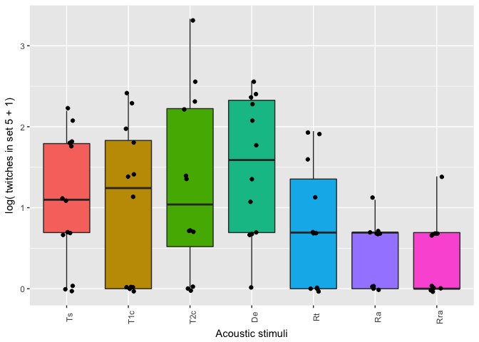<!-- -->

```r
gg<-ggplotly(p)
```
#Summary chart
| stim           | value_est |	sig_vals |
| :--------------|-----------|------|
|De|	1.4648|	a|
|t2c|	1.3472|	ab|
|t1c|	0.7578|	cd|
|ts|	0.776	| bcd|
|rt|	0.5023|	d|
|rra|	-0.7505|	e|
|ra|	-0.8318|	e|


---


